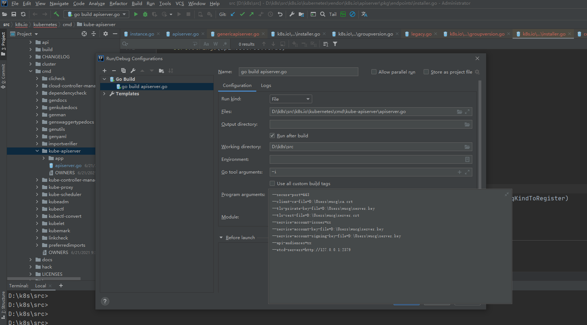
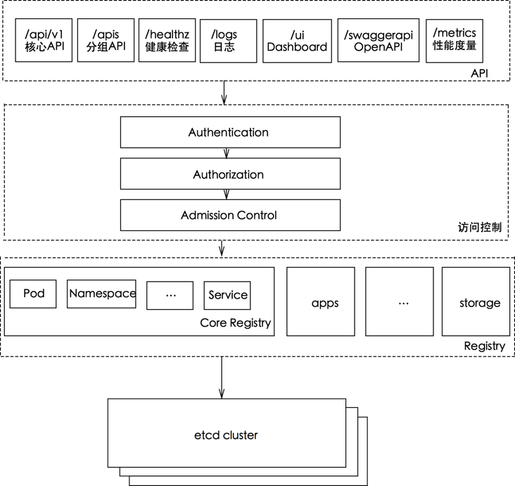

# k8s基础及kube-apiServer分享

目录：

1. k8s的基本概念
2. win10中kube-apiserver的源码调试环境搭建
3. apiserver中的一些重要概念
4. apiserver的启动流程

## kubernetes 介绍

### 服务发现和负载均衡
Kubernetes 可以使用 DNS 名称或自己的 IP 地址公开容器，如果到容器的流量很大，Kubernetes 可以负载均衡并分配网络流量，从而使部署稳定。

### 存储编排
Kubernetes 允许自动挂载选择的存储系统，例如本地存储、公共云提供商等。

### 自动部署和回滚
可以使用 Kubernetes 描述已部署容器的所需状态，它可以以受控的速率将实际状态更改为所需状态。例如，可以自动化 Kubernetes 来为您的部署创建新容器，删除现有容器并将它们的所有资源用于新容器。

### 自动二进制打包
Kubernetes 允许指定每个容器所需 CPU 和内存（RAM）。当容器指定了资源请求时，Kubernetes 可以做出更好的决策来管理容器的资源。

### 自我修复
Kubernetes 重新启动失败的容器、替换容器、杀死不响应用户定义的运行状况检查的容器，并且在准备好服务之前不将其通告给客户端。

### 密钥与配置管理

Kubernetes 允许您存储和管理敏感信息，例如密码、OAuth 令牌和 ssh 密钥。您可以在不重建容器镜像的情况下部署和更新密钥和应用程序配置，也无需在堆栈配置中暴露密钥。
Kubernetes 的出现不仅主宰了容器编排的市场，更改变了过去的运维方式，不仅将开发与运维之间边界变得更加模糊，而且让 DevOps 这一角色变得更加清晰，每一个软件工程师都可以通过 Kubernetes 来定义服务之间的拓扑关系、线上的节点个数、资源使用量并且能够快速实现水平扩容、蓝绿部署等在过去复杂的运维操作。

## 基础概念

### Master：
API Server: 所有服务访问的唯一入口，提供认证、授权、访问控制、API 注册和发现等机制,也是唯一一个与 etcd 集群通信的组件。
etcd: 键值对数据库，保存了整个集群的状态。
Scheduler: 负责资源的调度，按照预定的调度策略将 Pod 调度到相应的机器上。
controller-manager: 负责维护集群的状态，比如副本期望数量、故障检测、自动扩展、滚动更新等。

### slave：
它主要由 kubelet 和 kube-proxy 两部分组成。
kubelet: 是工作节点执行操作的 agent，负责维护容器的生命周期，同时也负责 Volume 和网络的管理
kube-proxy: 负责为 Service 提供 cluster 内部的服务发现和负载均衡。
Container Runtime: 负责为 Service 提供 cluster 内部的服务发现和负载均衡。

### 其他
Pod：Pause容器， 业务容器
Service：拥有唯一的名字， 有一个虚拟IP 和端口号，   service和pod的关系可以使用label进行关联
Namespace
Replicas
Deployment
CRD

## 运行举例

创建一个RC的过程：

1. Kubectl  提交一个RC的请求， 通过Api Server 将yaml文件写到etcd中
2. controller Manager 通过Api Server监听资源变化接口监听到RC事件， 分析之后， 创建一个Pod的实例对象，通过Api Server 写到etcd中
3. Scheduler 监听到此事件， 会启动调度程序为Pod选择好Node， 进行绑定， 然后通过Api Server 写到etcd中
4. 具体Node上的Kubelet进程通过Api Server监听到 新生成Pod的事件， 启动创建Pod的进程。

随后通过Kubectl 提交一个映射该Pod和Service的请求：

1. Controler Manager 通过Label标签查询Pod实例， 生成Service的EndPoint信息， 并通过Api Server 写到etcd中
2. Node中的Proxy进程就会通过Api Server 监听到Service对象和Endpoints的信息， 创建软件的负载均衡实现Service到Pod的流量转发


## k8s本地源码查看环境搭建

1. 基础环境信息：基础环境：win10 +idea + go插件 + go 1.16+

2. git clone https://github.com/kubernetes/kubernetes.git （git clone https://gitee.com/mirrors/kubernetes.git）下载到本地的创建创建的目录（$GoPath/src/k8s.io/）路径下

3. k8s代码库根目录vendor目录下存放了所有依赖包，但是vendor\k8s.io下诸如 kubectl、kubelet等包是软链到k8s根目录staging/src/k8s.io/下，windows不能识别，需要手工复制替换，具体操作过程为：删除vendor\k8s.io目录下所有的软链文件：如api、kubectl、kubelet等；复制staging下的相关包到vendor\k8s.io下；复制vendor目录下所有文件到GOPATH src目录下。

4. idea打开刚刚下载的代码： 直接找到启动文件使用kubernetes/cmd/kube-apiserver/apiserver.go，直接启动， 会有: underfined:"k8s.io/kubernetes/pkg/generated/openapi".GetOpenAPIDefinitions的报错。

5. linux或者mac机器上 重新下载刚刚的k8s源码， 然后进行make操作。先到pkg/generated/openapi目录下看看生成zz_generated.openapi.go

6. 将zz_generated.openapi.go拷贝到直接的项目中k8s.io/kubernetes/pkg/generated/openapi目录中(我是用的master分支，下面是我使用的文件)zz_generated.openapi.go

7. k8s有好几种安全认证的方式， 本文使用其中的CA双向认证， 所以需要安装openssl

8. 下载地址：http://slproweb.com/products/Win32OpenSSL.html (根据自己机器选择， 我选择的是win64 OpenSSL EXE)

9. 安装成功之后，使用win10的powerShell， 执行以下命令生成本地证书：
生成密钥
openssl genrsa -out ca.key 2048
生成根证书
openssl req -x509 -nodes -key ca.key -subj "/CN=DST66715" -days 5000 -out ca.crt
生成server证书：
openssl genrsa -out server.key 2048
openssl req -new -key server.key -subj "/CN=DST66715" -out server.csr
openssl x509 -req -in server.csr -CA ca.crt -CAkey ca.key -CAcreateserial -out server.crt -days 5000
生成client证书：
openssl genrsa -out client.key 2048
openssl req -new -key client.key -subj "/CN=DST66715" -out client.csr
openssl x509 -req -in client.csr -CA ca.crt -CAkey ca.key -CAcreateserial -out client.crt -days 5000

10. 如果是启动kube-apiserver， 因为该模块依赖etcd数据库， 所以需要本地安装etcd，下载地址：https://github.com/etcd-io/etcd/releases

11. powerShell进入安装目录
执行.\etcd.exe 启动etcd
另开一个powerShell， 执行set ETCDCTL_API=3 选用etcd3
执行.\etcdctl.exe version 可以查看版本
etcdctl --endpoints=http://127.0.0.1:2379 put name "gaofushuai"
etcdctl --endpoints=http://127.0.0.1:2379 get name
可以查询到写入的数据， 说明安装成功了

12. idea打开k8s的项目， 如图所示， 配置启动参数(因为我本地安装还有一个k8s的环境端口是6443， 所有代码中我配置的是443， 另外证书路径需要改成大家自己的路径)

--secure-port=443
--client-ca-file=D:\Users\wucg\ca.crt
--tls-private-key-file=D:\Users\wucg\server.key
--tls-cert-file=D:\Users\wucg\server.crt
--service-account-issuer=xx
--service-account-key-file=D:\Users\wucg\server.key
--service-account-signing-key-file=D:\Users\wucg\server.key
--api-audiences=xx
--etcd-servers=http://127.0.0.1:2379
更多参数可以参考：https://kubernetes.io/zh/docs/reference/command-line-tools-reference/kube-apiserver/

13. 启动成功应该就成功了， 用postman验证kube-apiserver是不是成功启动
postman File->Setting->General，关闭“SSL certificate verification”
在上面的弹出界面中选择Certificates，并点击 添加证书
Host: 填写 127.0.0.1:443
CRT file和KEY file 选择刚刚openssl生成的client端证书
之后在postman中https://127.0.0.1:443 查看k8s的API相关接口
(另：还可以安装kubectl 使用命令行的形式调用kube-apiserver，在home的.kube下面有conf文件可以配置)

## Group/Version/Kind/Resource

resource是其最基础、最重要的概念，也是最小的管理单位，所有的管理对象都承载在一个个的resource实例上，为了实现这些resource的复杂管理逻辑，又进一步地将他们分组化、版本化，依照逻辑层次，形成了Group、Version、Kind、Resource核心数据结构：Group：资源组，也称APIGroup，常见的有core、apps、extensions等
Version：资源版本，也称APIVersion，常见的有v1、v1beta1 (Resource可能属于拥有多个Version，这些version也会有优先级之分，例如Deployment即属于apps/v1,又属于extensions/v1beta1，在不同k8s版本中，version的优先级可能会变化)
Kind：资源种类，描述资源的类别，例如pod类别、svc类别等
Resource：资源实例对象，也称为APIResource
SubResource：子资源，部分资源实例会 有子资源，例如Deployment资源会拥有Status子资源
CRD: Custom Resource Definitions，用户自定义资源类型
概念层面，在K8s中，常见的资源路径锚定形式为：///，例如deployment对应的路径是：apps/v1/deployments/status
官方通常通过缩写词GVR(GroupVersionKind)来描述一个资源的明确锚定位置(类似于绝对路径？)，同理，GVK(GroupVersionKind)锚定资源的明
确所属类型，在项目代码中也经常用到
vendor/k8s.io/apimachinery/pkg/runtime/schema/group_version.go

```go
type GroupVersionResource struct {
	Group    string
	Version  string
	Resource string
}
```

## 资源结构体
而落实到代码中，每一种资源的结构体定义文件都位于其Group下的的types.go文件中，例如，Deployment资源的结构体定义在这里：pkg/apis/apps/types.go

```go
type Deployment struct {
	metav1.TypeMeta
	// +optional
	metav1.ObjectMeta

	// Specification of the desired behavior of the Deployment.
	// +optional
	Spec DeploymentSpec

	// Most recently observed status of the Deployment.
	// +optional
	Status DeploymentStatus
}
```

## 资源操作方法

概念层面，每种resource都有对应的管理操作方法，目前支持的有这几种
get
list
create
update
patch
delete
deletecolletction
知识点：watch
落实到代码里，资源对应的操作方法，都在metav1.Verbs结构体中归纳：
vendor/k8s.io/apimachinery/pkg/apis/meta/v1/types.go

```go
type APIResource struct {
// name is the plural name of the resource.
	Name string `json:"name" protobuf:"bytes,1,opt,name=name"`
	// singularName is the singular name of the resource.  This allows clients to handle plural and singular opaquely.
	// The singularName is more correct for reporting status on a single item and both singular and plural are allowed
	// from the kubectl CLI interface.
	SingularName string `json:"singularName" protobuf:"bytes,6,opt,name=singularName"`
	// namespaced indicates if a resource is namespaced or not.
	Namespaced bool `json:"namespaced" protobuf:"varint,2,opt,name=namespaced"`
	// group is the preferred group of the resource.  Empty implies the group of the containing resource list.
	// For subresources, this may have a different value, for example: Scale".
	Group string `json:"group,omitempty" protobuf:"bytes,8,opt,name=group"`
	...
}
type Verbs []string

func (vs Verbs) String() string {
	return fmt.Sprintf("%v", []string(vs))
}
```

使用[]string结构来描述资源所对应的操作，而[]string终归只是描述，需要与实际的存储资源CRUD操作关联，因此，不难猜测，每种string描述的方法会map到具体的方法上去，结构类似于: map[string]Function

## 内部和外部Version

在k8s的设计中，资源版本分外部版本(external)和内部版本(internal)之分，外部版本(例如v1/v1beta1/v1beta2)提供给外部使用，而对应的内部版本仅在APIServer内部使用。
区分内外版本的作用：
提供不同版本之间的转换功能，例如从v1beta1-->v1的过程实际是v1beta1--> internal -->v1，转换函数会注册到scheme表中
减少复杂度，方便版本维护，避免维护多个版本的对应代码，实际APIServer端处理的都是转换后的内部版本
不同外部版本资源之间的字段/功能可能存在些许差异，而内部版本包含所有版本的字段/功能，这为它作为外部资源版本之间转换的桥梁提供了基础。
内部版本和外部版本对于资源结构体定义显著的区别是，内部版本是不带json和proto标签的，因为其不需要结构化提供给外部。以Deployment资源为例
内部版本的代码路径为：pkg/apis/apps/types.go

```go
type Deployment struct {
	metav1.TypeMeta
	// +optional
	metav1.ObjectMeta
...
}
```

外部版本代码路径：vendor/k8s.io/api/apps/v1/types.go

```go
type Deployment struct {
   metav1.TypeMeta `json:",inline"`
   ...
}
```

以向APIServer发起创建一个资源实例为例，在解码时，APIServer首先从 HTTP 路径中获取对应的外部version，然后使用 scheme 以外部version创建一个空对象，然后将该对象转换成内部版本对应的对象结构进行持久存储(写入etcd).
而在查询请求中，资源对象会被从内部版本转换为路径对应的外部版本，响应给请求端。(知识点：kubernetes中的api多版本中反序列化与转换)

## 安全认证
知识点
认证： 身份鉴别，正确的账号，能够通过认证，其只能证明其是合法的账户。
授权： 权限检查，对资源进行相应的操作。其可操作某些资源，其某些资源需要关联其他资源，其对此种相关关联的资源的操作则无相关权限，此时便需要准入控制了。
准入控制： 用于补充授权机制以实现更加精细的访问控制功能。这次操作会关联到其他资源或影响其他操作。一般在创建，修改，删除和代理方面做某些限制操作。

## Scheme注册表

每一种Resource都有对应的Kind，为了更便于分类管理这些资源，APIServer设计了一种名为scheme的结构体，类似于注册表，运行时数据存放内存中，提供给各种资源进行注册，scheme有如下作用：
提供资源的版本转换功能
提供资源的序列化/反序列化功能
scheme结构体
vendor/k8s.io/apimachinery/pkg/runtime/scheme.go

```go
type Scheme struct {
	// versionMap allows one to figure out the go type of an object with
	// the given version and name.
	gvkToType map[schema.GroupVersionKind]reflect.Type

	// typeToGroupVersion allows one to find metadata for a given go object.
	// The reflect.Type we index by should *not* be a pointer.
	typeToGVK map[reflect.Type][]schema.GroupVersionKind

	// unversionedTypes are transformed without conversion in ConvertToVersion.
	unversionedTypes map[reflect.Type]schema.GroupVersionKind

	// unversionedKinds are the names of kinds that can be created in the context of any group
	// or version
	// TODO: resolve the status of unversioned types.
	unversionedKinds map[string]reflect.Type
	...
}
```

重点关注字段：
gvkToType ：用map结构存储gvk和Type的映射关系，一个gvk只会具体对应一个Type
typeToGVK：用map结构存储type和gvk的映射关系，不同的是，一个type可能会对应多个gvk
converter：map结构，存放资源版本转换的方法
注册方法
scheme表提供两个注册方法：AddKnownTypes | AddKnownTypeWithName ，使用reflect反射的方式获取type obj的gvk然后进行注册。
vendor/k8s.io/apimachinery/pkg/runtime/scheme.go

```go
func (s *Scheme) AddKnownTypes(gv schema.GroupVersion, types ...Object) {
...
}

vendor/k8s.io/apimachinery/pkg/runtime/scheme.go
func (s *Scheme) AddKnownTypeWithName(gvk schema.GroupVersionKind, obj Object) {
...
}
```

## 序列化与反序列化

APIServer对资源的描述支持yaml和json格式，分别对应不同的Serializer，Serializer内置有bool类型的yaml字段，来辨别是否是yaml Serializer.
vendor/k8s.io/apimachinery/pkg/runtime/serializer/json/json.go

```go
type Serializer struct {
	meta    MetaFactory
	creater runtime.ObjectCreater
	typer   runtime.ObjectTyper
	yaml    bool
	pretty  bool
}
```

### go-restful框架

k8s选用的Restful框架是go-restful，简单说明一下go-restful的结构，辅助后面对于APIServer工作流程的理解。
go-restful层级结构概念自顶上下依次有:
Container: 一个Container就是一个独立的http server，可拥有独立的地址端口组合(类似nginx的server层级)
WebService： 大粒度的分类，某一类别的服务可归属到同一个WebService中，其下包含多个Route
Route: 每个Route对应具体的uri路径，将该路径路由到对应的handler函数上
流程：
1.创建一个Container
2.创建一个WebService
3.创建handler
4.将API path和handler绑定到WebService
5.将WebService添加到Container
6 启动包含Container的Server

### cobra框架：命令行项目生成框架

## kube-apiserver的主要功能


API 接口查询，监听集群（资源）状态的服务，kube-apiserver 主要就做一件事，就是如何将 RESTful API （CREATE, DELETE, UPDATE, GET .etc）接口调用映射到对后端存储（比如 etcd）的（增删改查）访问，在设计的时候考虑到 k8s 是个快速迭代的开源项目，很多 API 接口（版本）可能在未来版本发生变化，因此如何设计一个扩展性强，耦合度低的架构应该是 Google当初主要考虑的问题，所以才导致 kube-apiserver 本来相比 kube-scheduler 和 kube-controller-manager 应该简单的代码设计的很复杂.
APIServer的工作主要是围绕着各类资源对象的管控， 因此， 在运行中就会有很多的核心资源对象的数据结构

## k8s源码中的几个重要的包

build： 编译脚本目录
CHANGELOG：变更记录文档
cmd： 对应命令行管理工具,例如kubeadm、kubectl、kubelet等 
staging： 已经分库的项目
pkg：各种功能包的实现代码
vendor： 依赖包
API Server是Kubernetes的核心组件之一，其作用是通过RESTFUL的方式，向所有客户端提供一个集群内资源的统一的增改删查的接口，并将资源的状态存储在etcd中。API Server入口函数的位置在cmd/kube-apiserver/apiserver.go中，也是通过cobra注册了kube-apiserver的命令。

1. 首先找到apiserver.go中的main函数， 这是整个程序的入口
1.1 api-server的启动入口： 主要做四件事情
(1).资源注册 (import)
(2).生成APIServer启动命令
(3).初始化log
(4).运行APIServer命令

* 1.调用 CreateKubeAPIServerConfig 创建 KubeAPIServer 所需要的配置:
   
    * 1.1主要是创建 Config，其中会调用 buildGenericConfig 生成 genericConfig
    * 1.2DefaultAPIResourceConfigSource， 创建各种APIResource,
    * 1.3ETCD的存储
    * 1.4安全认证

* 2.判断是否启用了扩展的 API server 并调用 createAPIExtensionsConfig 为其创建配置；（略）

* 3.调用 createAPIExtensionsServer 创建 apiExtensionsServer 实例
    
    * 3.1c.GenericConfig.New 按照go-restful的模式初始化 Container
    * 3.2NewAPIServerHandler初始化handler，
    * 3.3installAPI添加 /、/debug/*、/metrics、/version等路由信息
    * 3.4InstallAPIGroup 注册 APIResources
    * 3.5初始化 server 中需要使用的controller
    * 3.6启动的controller以及informer添加到 PostStartHook中

* 4.调用 CreateKubeAPIServer 初始化 kubeAPIServer；

    * 4.1调用 c.GenericConfig.New 初始化 GenericAPIServer
    * 4.2NewAPIServerHandler初始化handler，
    * 4.2注册 logs 相关的路由
    * 4.3调用 m.InstallLegacyAPI 将核心 API Resource 添加到路由中，对应到 apiserver 就是以 /api 开头的 resource
    * 4.4调用 m.InstallAPIs 将扩展的 API Resource 添加到路由中，在 apiserver 中即是以 /apis 开头的 resource
    * 4.5启动的controller以及informer添加到 PostStartHook中

* 5.createAggregatorConfig配置 （略）
* 6.调用 createAggregatorServer 初始化 aggregatorServer

    * 6.1c.GenericConfig.New按照go-restful的模式初始化 Container
    * 6.2NewAPIServerHandler初始化handler
    * 6.3初始化 crd controller
    * 6.4crdRegistrationController以及autoRegistrationController添加到PostStartHook

* 7.配置并判断是否启动非安全的 http server

```go
                    |--> CreateKubeAPIServerConfig
                    |
CreateServerChain --|--> createAPIExtensionsConfig
                    |
                    |                                                                       |--> c.GenericConfig.New
                    |--> createAPIExtensionsServer --> apiextensionsConfig.Complete().New --|
                    |                                                                       |--> s.GenericAPIServer.InstallAPIGroup
                    |
                    |                                                                 |--> c.GenericConfig.New
                    |                                                                 |
                    |--> CreateKubeAPIServer --> kubeAPIServerConfig.Complete().New --|--> m.InstallLegacyAPI --> legacyRESTStorageProvider.NewLegacyRESTStorage --> m.GenericAPIServer.InstallLegacyAPIGroup
                    |                                                                 |
                    |                                                                 |--> m.InstallAPIs --> restStorageBuilder.NewRESTStorage --> m.GenericAPIServer.InstallAPIGroups
                    |
                    |
                    |--> createAggregatorConfig
                    |
                    |                                                                             |--> c.GenericConfig.New
                    |                                                                             |
                    |--> createAggregatorServer --> aggregatorConfig.Complete().NewWithDelegate --|--> apiservicerest.NewRESTStorage
                                                                                                  |
                                                                                                  |--> s.GenericAPIServer.InstallAPIGroup
```

etcd操作创建:
CreateKubeAPIServerConfig ---> buildGenericConfig--->ApplyWithStorageFactoryTo--->StorageFactoryRestOptionsFactory  (这个结构体拥有一个方法GetRESTOptions)--->generic.UndecoratedStorage或者genericregistry.StorageWithCacher--->NewRawStorage--->Create--->newETCD3Storage--->etcd3.New--->newStore--->type store struct这样的结构体（etcd继承使用client端）---> 继承了type Interface interface中的接口（该接口是k8s操作存储的接口）

以创建Pod为例：
CreateKubeAPIServer--->New--->InstallLegacyAPI--->NewLegacyRESTStorage--->podstore.NewStorage(返回各种REST)--->
CompleteWithOptions--->GetRESTOptions

最后返回的是一个restStorageMap 保存 resource http path 与 RESTStorage 对应关系 (举例"pods":podStorage.Pod的对应关系)

路由注册(最终是为 Group 下每一个 API resources 注册 handler 及路由信息)：
CreateKubeAPIServer--->New--->InstallLegacyAPI--->NewLegacyRESTStorage--->InstallLegacyAPIGroup(举例注册以/api开头的)--->installAPIResources(为每一个 API resource 调用 apiGroupVersion.InstallREST 添加路由)--->InstallREST(代码：prefix := path.Join(g.Root, g.GroupVersion.Group, g.GroupVersion.Version) 这里加载的核心APIGroup 都有一个共同的前缀/api/v1, 将 restful.WebServic 对象添加到 container 中)--->Install(返回最终的 restful.WebService 对象)--->registerResourceHandlers--->

1. 判断该 resource 实现了哪些 REST 操作接口，以此来判断其支持的操作以便为其添加路由(//what verbs are supported by the storage, used to know what verbs we support per path)
2. 为 resource 添加对应的 actions(+根据是否支持 namespace)(//Get the list of actions for the given scope.)
3. 根据 action 创建对应的 route (kubeVerbs := map[string]struct{}{})
4. 从 rest.Storage 到 restful.Route 映射， 为每个操作添加对应的 handler  (for _, action := range actions {...)
5. 初始化 handler  (handler )
6. route 与 handler 进行绑定  (route := ws.POST(action.Path).To(handler).)
7. 添加到路由中   (routes = append(routes, route))

API查询 https://kubernetes.io/docs/reference/kubernetes-api/workload-resources/pod-v1/

#############################################
后面选读
#############################################
cmd/kube-apiserver/app/server.go

```go
import (
		"k8s.io/kubernetes/pkg/api/legacyscheme"
  	"k8s.io/kubernetes/pkg/controlplane"
 		...
)
```

这里列举的两个包，legacyscheme包在导入时会初始化空的scheme注册表，master包初始化时会向scheme表install注册gvk。
pkg/api/legacyscheme/scheme.go

```go
// Scheme is the default instance of runtime.Scheme to which types in the Kubernetes API are already registered.
// NOTE: If you are copying this file to start a new api group, STOP! Copy the
// extensions group instead. This Scheme is special and should appear ONLY in
// the api group, unless you really know what you're doing.
// TODO(lavalamp): make the above error impossible.
var Scheme = runtime.NewScheme()

// Codecs provides access to encoding and decoding for the scheme
var Codecs = serializer.NewCodecFactory(Scheme)

// ParameterCodec handles versioning of objects that are converted to query parameters.
var ParameterCodec = runtime.NewParameterCodec(Scheme)
```

pkg/controlplane/import_known_versions.go

```go
// These imports are the API groups the API server will support.
import (
	_ "k8s.io/kubernetes/pkg/apis/admission/install"
	_ "k8s.io/kubernetes/pkg/apis/admissionregistration/install"
	_ "k8s.io/kubernetes/pkg/apis/apps/install"
	_ "k8s.io/kubernetes/pkg/apis/auditregistration/install"
	_ "k8s.io/kubernetes/pkg/apis/authentication/install"
	_ "k8s.io/kubernetes/pkg/apis/authorization/install"
	_ "k8s.io/kubernetes/pkg/apis/autoscaling/install"
	_ "k8s.io/kubernetes/pkg/apis/batch/install"
	_ "k8s.io/kubernetes/pkg/apis/certificates/install"
	_ "k8s.io/kubernetes/pkg/apis/coordination/install"
	_ "k8s.io/kubernetes/pkg/apis/core/install"
	_ "k8s.io/kubernetes/pkg/apis/events/install"
	_ "k8s.io/kubernetes/pkg/apis/extensions/install"
	_ "k8s.io/kubernetes/pkg/apis/imagepolicy/install"
	_ "k8s.io/kubernetes/pkg/apis/networking/install"
	_ "k8s.io/kubernetes/pkg/apis/node/install"
	_ "k8s.io/kubernetes/pkg/apis/policy/install"
	_ "k8s.io/kubernetes/pkg/apis/rbac/install"
	_ "k8s.io/kubernetes/pkg/apis/scheduling/install"
	_ "k8s.io/kubernetes/pkg/apis/settings/install"
	_ "k8s.io/kubernetes/pkg/apis/storage/install"
)
```

这里会把所有内置group的install包导入，列举其中的"k8s.io/kubernetes/pkg/apis/apps/install" group为例，进入其中:
pkg/apis/apps/install/install.go

```go
func init() {
	Install(legacyscheme.Scheme)
}

// Install registers the API group and adds types to a scheme
func Install(scheme *runtime.Scheme) {
	utilruntime.Must(apps.AddToScheme(scheme))
	utilruntime.Must(v1beta1.AddToScheme(scheme))
	utilruntime.Must(v1beta2.AddToScheme(scheme))
	utilruntime.Must(v1.AddToScheme(scheme))
	utilruntime.Must(scheme.SetVersionPriority(v1.SchemeGroupVersion, v1beta2.SchemeGroupVersion, v1beta1.SchemeGroupVersion))
}
```

这里可以看到，依次将group、version注册到了scheme中，并设置各version的优先级
Cobra 命令参数解析
关于Cobra的参数解析，固定框架模式， 这里暂时先不用管
从Run()开始进入，找到初始化默认配置的方法：
cmd/kube-apiserver/app/server.go

```go
// Run runs the specified APIServer.  This should never exit.
func Run(completeOptions completedServerRunOptions, stopCh <-chan struct{}) error {
	// To help debugging, immediately log version
	klog.Infof("Version: %+v", version.Get())
  
  // 创建一组server链
	server, err := CreateServerChain(completeOptions, stopCh)
	if err != nil {
		return err
	}

	return server.PrepareRun().Run(stopCh)
}
```

--> cmd/kube-apiserver/app/server.go CreateServerChain()

--> cmd/kube-apiserver/app/server.go CreateKubeAPIServerConfig()

--> cmd/kube-apiserver/app/server.go  buildGenericConfig(s.ServerRunOptions, proxyTransport)

APIServer因其模块众多，相应的配置参数也非常之多，分类一下：
genericConfig 通用配置
OpenAPI配置
Storage (etcd)配置
Authentication 认证配置
Authorization 授权配置
Admission 准入配置
创建APIExtensionsServer
上面在初始化完默认的配置后，并没有立即装载创建APIServer，K8s专门设计了一个扩展型的APIExtensionsServer，为CRD提供服务，首先创建的是APIExtensionsServer.
拆解一下这个函数的流程：

1、创建GenericServer
2、实例化CRD 的APIServer
3、将CRD的GV/GVR及子资源与storage对象进行关联映射
4、注册APIGroup

创建GenericServer：
genericServer, err := c.GenericConfig.New("apiextensions-apiserver", delegationTarget)
genericServer提供了一个通用的http server，定义了通用的模板，例如地址、端口、认证、授权、健康检查等等通用功能。无论是APIServer还是APIExtensionsServer都依赖于genericServer。
实例化CRD和APIGroup

```go
	s := &CustomResourceDefinitions{
		GenericAPIServer: genericServer,
	}

	apiResourceConfig := c.GenericConfig.MergedResourceConfig
	apiGroupInfo := genericapiserver.NewDefaultAPIGroupInfo(apiextensions.GroupName, Scheme, metav1.ParameterCodec, Codecs)
  // 判断配置中是否开启了apiextensions.k8s.io/v1beta1这个GV
	if apiResourceConfig.VersionEnabled(v1beta1.SchemeGroupVersion) {
		storage := map[string]rest.Storage{}
		// 生成CRD对应的RESTStorage
		customResourceDefintionStorage := customresourcedefinition.NewREST(Scheme, c.GenericConfig.RESTOptionsGetter)
		storage["customresourcedefinitions"] = customResourceDefintionStorage
    // 生成CRD status子资源对应的RESTStorage
		storage["customresourcedefinitions/status"] = customresourcedefinition.NewStatusREST(Scheme, customResourceDefintionStorage)
    // 将apiGroupInfo和RESTStorage关联起来，下一步注册apiGroupInfo会用到
		apiGroupInfo.VersionedResourcesStorageMap["v1beta1"] = storage
	}
```

重点是里面的customresourcedefinition.NewREST()方法：
vendor/k8s.io/apiextensions-apiserver/pkg/registry/customresourcedefinition/etcd.go

```go
// NewREST returns a RESTStorage object that will work against API services.
func NewREST(scheme *runtime.Scheme, optsGetter generic.RESTOptionsGetter) *REST {
   strategy := NewStrategy(scheme)

   store := &genericregistry.Store{
      NewFunc:                  func() runtime.Object { return &apiextensions.CustomResourceDefinition{} },
      NewListFunc:              func() runtime.Object { return &apiextensions.CustomResourceDefinitionList{} },
      PredicateFunc:            MatchCustomResourceDefinition,
      DefaultQualifiedResource: apiextensions.Resource("customresourcedefinitions"),

      CreateStrategy: strategy,
      UpdateStrategy: strategy,
      DeleteStrategy: strategy,
   }
   options := &generic.StoreOptions{RESTOptions: optsGetter, AttrFunc: GetAttrs}
   if err := store.CompleteWithOptions(options); err != nil {
      panic(err) // TODO: Propagate error up
   }
   return &REST{store}
}
```

核心是genericregistry.Store{}结构体:
vendor/k8s.io/apiserver/pkg/registry/generic/registry/store.go

```go
// The intended use of this type is embedding within a Kind specific
// RESTStorage implementation. This type provides CRUD semantics on a Kubelike
// resource, handling details like conflict detection with ResourceVersion and
// semantics. The RESTCreateStrategy, RESTUpdateStrategy, and
// RESTDeleteStrategy are generic across all backends, and encapsulate logic
// specific to the API.
//
// TODO: make the default exposed methods exactly match a generic RESTStorage
type Store struct {
   // NewFunc returns a new instance of the type this registry returns for a
   // GET of a single object, e.g.:
   //
   // curl GET /apis/group/version/namespaces/my-ns/myresource/name-of-object
   NewFunc func() runtime.Object

   // NewListFunc returns a new list of the type this registry; it is the
   // type returned when the resource is listed, e.g.:
   //
   // curl GET /apis/group/version/namespaces/my-ns/myresource
   NewListFunc func() runtime.Object
 ... 
}
```

从注释中可以看出，Store结构体是一个对于各类k8s资源通用的REST封装的实现，可以实现CURD功能以及满足相应的CURD策略，同时实现了对接后端etcd存储进行相应的增删改查操作。
在这里注册了CRD对应的Store后，即可实现其对应的CURD方法，例如查询某个CRD对象对应的api是:
注册APIGroup

vendor/k8s.io/apiextensions-apiserver/pkg/apiserver/apiserver.go
--> vendor/k8s.io/apiserver/pkg/server/genericapiserver.go
--> vendor/k8s.io/apiserver/pkg/server/genericapiserver.go

```go
func (s *GenericAPIServer) InstallAPIGroups(apiGroupInfos ...*APIGroupInfo) error {
   ...
   // 注册APIGroup下的所有resource并注册
   for _, apiGroupInfo := range apiGroupInfos {
      if err := s.installAPIResources(APIGroupPrefix, apiGroupInfo, openAPIModels); err != nil {
         return fmt.Errorf("unable to install api resources: %v", err)
      }

      // setup discovery
      // Install the version handler.
      // Add a handler at /apis/<groupName> to enumerate all versions supported by this group.
      apiVersionsForDiscovery := []metav1.GroupVersionForDiscovery{}
      for _, groupVersion := range apiGroupInfo.PrioritizedVersions {
         // Check the config to make sure that we elide versions that don't have any resources
         if len(apiGroupInfo.VersionedResourcesStorageMap[groupVersion.Version]) == 0 {
            continue
         }
         apiVersionsForDiscovery = append(apiVersionsForDiscovery, metav1.GroupVersionForDiscovery{
            GroupVersion: groupVersion.String(),
            Version:      groupVersion.Version,
         })
      }
      preferredVersionForDiscovery := metav1.GroupVersionForDiscovery{
         GroupVersion: apiGroupInfo.PrioritizedVersions[0].String(),
         Version:      apiGroupInfo.PrioritizedVersions[0].Version,
      }
      apiGroup := metav1.APIGroup{
         Name:             apiGroupInfo.PrioritizedVersions[0].Group,
         Versions:         apiVersionsForDiscovery,
         PreferredVersion: preferredVersionForDiscovery,
      }

      s.DiscoveryGroupManager.AddGroup(apiGroup)
      s.Handler.GoRestfulContainer.Add(discovery.NewAPIGroupHandler(s.Serializer, apiGroup).WebService())
   }
   return nil
}
```

来看看s.installAPIResources()方法：
vendor/k8s.io/apiserver/pkg/server/genericapiserver.go

```go
// installAPIResources is a private method for installing the REST storage backing each api groupversionresource
func (s *GenericAPIServer) installAPIResources(apiPrefix string, apiGroupInfo *APIGroupInfo, openAPIModels openapiproto.Models) error {
   for _, groupVersion := range apiGroupInfo.PrioritizedVersions {
      if len(apiGroupInfo.VersionedResourcesStorageMap[groupVersion.Version]) == 0 {
         klog.Warningf("Skipping API %v because it has no resources.", groupVersion)
         continue
      }

      apiGroupVersion := s.getAPIGroupVersion(apiGroupInfo, groupVersion, apiPrefix)
      if apiGroupInfo.OptionsExternalVersion != nil {
         apiGroupVersion.OptionsExternalVersion = apiGroupInfo.OptionsExternalVersion
      }
      apiGroupVersion.OpenAPIModels = openAPIModels
      apiGroupVersion.MaxRequestBodyBytes = s.maxRequestBodyBytes

      if err := apiGroupVersion.InstallREST(s.Handler.GoRestfulContainer); err != nil {
         return fmt.Errorf("unable to setup API %v: %v", apiGroupInfo, err)
      }
   }

   return nil
}
```

遍历GroupVersion，调用 apiGroupVersion.InstallREST()方法:
vendor/k8s.io/apiserver/pkg/endpoints/groupversion.go

```go
// InstallREST registers the REST handlers (storage, watch, proxy and redirect) into a restful Container.
// It is expected that the provided path root prefix will serve all operations. Root MUST NOT end
// in a slash.
func (g *APIGroupVersion) InstallREST(container *restful.Container) error {
   prefix := path.Join(g.Root, g.GroupVersion.Group, g.GroupVersion.Version)
   installer := &APIInstaller{
      group:                        g,
      prefix:                       prefix,
      minRequestTimeout:            g.MinRequestTimeout,
      enableAPIResponseCompression: g.EnableAPIResponseCompression,
   }

   apiResources, ws, registrationErrors := installer.Install()
   versionDiscoveryHandler := discovery.NewAPIVersionHandler(g.Serializer, g.GroupVersion, staticLister{apiResources})
   versionDiscoveryHandler.AddToWebService(ws)
   container.Add(ws)
   return utilerrors.NewAggregate(registrationErrors)
}
```

调用installer.Install()安装VersionGroup内的Resource：

```go
vendor/k8s.io/apiserver/pkg/endpoints/installer.go

func (a *APIInstaller) Install() ([]metav1.APIResource, *restful.WebService, []error) {
	var apiResources []metav1.APIResource
	var errors []error
  // new 一个go-restful WebService实例
	ws := a.newWebService()

	// Register the paths in a deterministic (sorted) order to get a deterministic swagger spec.
	paths := make([]string, len(a.group.Storage))
	var i int = 0
	for path := range a.group.Storage {
		paths[i] = path
		i++
	}
	sort.Strings(paths)
	for _, path := range paths {
    // 将上一步的RESTStorage与ws绑定，通过此方法，将http 路径路由到RESTStorage对应的方法上去
		apiResource, err := a.registerResourceHandlers(path, a.group.Storage[path], ws)
		if err != nil {
			errors = append(errors, fmt.Errorf("error in registering resource: %s, %v", path, err))
		}
		if apiResource != nil {
			apiResources = append(apiResources, *apiResource)
		}
	}
	return apiResources, ws, errors
}
```

在这里，用到了上一章基础篇提到的go-restful模块，通过go-restful WebService对象，a.registerResourceHandlers()方法将http访问路径与上一步得到的RESTStorage对象进行绑定，即可把相应路径的请求路由到RESTStorage对应的方法上去。
APIServer启动分为以下几步：
1、创建GenericServer
2、实例化master APIServer(Kube APIServer)
3、注册/api下的资源(LegacyAPI)
4、注册/apis下的资源
其实与上面启动APIExtensionsServer的流程基本大差不差，篇幅有限重复的地方尽量简略跳过，直接进入第三步。

注册LegacyAPI

```go
// install legacy rest storage
if c.ExtraConfig.APIResourceConfigSource.VersionEnabled(apiv1.SchemeGroupVersion) {
   legacyRESTStorageProvider := corerest.LegacyRESTStorageProvider{
      StorageFactory:              c.ExtraConfig.StorageFactory,
      ProxyTransport:              c.ExtraConfig.ProxyTransport,
      KubeletClientConfig:         c.ExtraConfig.KubeletClientConfig,
      EventTTL:                    c.ExtraConfig.EventTTL,
      ServiceIPRange:              c.ExtraConfig.ServiceIPRange,
      ServiceNodePortRange:        c.ExtraConfig.ServiceNodePortRange,
      LoopbackClientConfig:        c.GenericConfig.LoopbackClientConfig,
      ServiceAccountIssuer:        c.ExtraConfig.ServiceAccountIssuer,
      ServiceAccountMaxExpiration: c.ExtraConfig.ServiceAccountMaxExpiration,
      APIAudiences:                c.GenericConfig.Authentication.APIAudiences,
   }
   m.InstallLegacyAPI(&c, c.GenericConfig.RESTOptionsGetter, legacyRESTStorageProvider)
}
```

```go
// InstallLegacyAPI will install the legacy APIs for the restStorageProviders if they are enabled.
func (m *Instance) InstallLegacyAPI(c *completedConfig, restOptionsGetter generic.RESTOptionsGetter, legacyRESTStorageProvider corerest.LegacyRESTStorageProvider) error {
	//创建各个资源的RESTStorage
	legacyRESTStorage, apiGroupInfo, err := legacyRESTStorageProvider.NewLegacyRESTStorage(restOptionsGetter)
	if err != nil {
		return fmt.Errorf("error building core storage: %v", err)
	}

	controllerName := "bootstrap-controller"
	coreClient := corev1client.NewForConfigOrDie(c.GenericConfig.LoopbackClientConfig)
	bootstrapController := c.NewBootstrapController(legacyRESTStorage, coreClient, coreClient, coreClient, coreClient.RESTClient())
	m.GenericAPIServer.AddPostStartHookOrDie(controllerName, bootstrapController.PostStartHook)
	m.GenericAPIServer.AddPreShutdownHookOrDie(controllerName, bootstrapController.PreShutdownHook)

	//为API Server注册“v1”路由。
	//首先，判断传入的前缀是否合法。//其次，调用installAPIResources方法。也就是为route注册一个handler//最后，在/api路径下生成一个WebService，并添加进Container
	if err := m.GenericAPIServer.InstallLegacyAPIGroup(genericapiserver.DefaultLegacyAPIPrefix, &apiGroupInfo); err != nil {
		return fmt.Errorf("error in registering group versions: %v", err)
	}
	return nil
}
```

展开legacyRESTStorageProvider.NewLegacyRESTStorage(restOptionsGetter)可以看到，这里注册的都是core/v1组里的资源，例如(pod/service/replicas/nodes)等等，所谓Legacy，指的即是核心组，路径是/api。后面的步骤与APIExtensionsServer里的相似，不再赘述。

注册/apis下的资源
```go
restStorageProviders := []RESTStorageProvider{
		auditregistrationrest.RESTStorageProvider{},
		authenticationrest.RESTStorageProvider{Authenticator: c.GenericConfig.Authentication.Authenticator, APIAudiences: c.GenericConfig.Authentication.APIAudiences},
		authorizationrest.RESTStorageProvider{Authorizer: c.GenericConfig.Authorization.Authorizer, RuleResolver: c.GenericConfig.RuleResolver},
		autoscalingrest.RESTStorageProvider{},
		batchrest.RESTStorageProvider{},
		certificatesrest.RESTStorageProvider{},
		coordinationrest.RESTStorageProvider{},
		extensionsrest.RESTStorageProvider{},
		networkingrest.RESTStorageProvider{},
		noderest.RESTStorageProvider{},
		policyrest.RESTStorageProvider{},
		rbacrest.RESTStorageProvider{Authorizer: c.GenericConfig.Authorization.Authorizer},
		schedulingrest.RESTStorageProvider{},
		settingsrest.RESTStorageProvider{},
		storagerest.RESTStorageProvider{},
		// keep apps after extensions so legacy clients resolve the extensions versions of shared resource names.
		// See https://github.com/kubernetes/kubernetes/issues/42392
		appsrest.RESTStorageProvider{},
		admissionregistrationrest.RESTStorageProvider{},
		eventsrest.RESTStorageProvider{TTL: c.ExtraConfig.EventTTL},
	}
	m.InstallAPIs(c.ExtraConfig.APIResourceConfigSource, c.GenericConfig.RESTOptionsGetter, restStorageProviders...)
```

注册/apis路径下的GV内的资源，例如apps/extension组等。
创建AggregatorServer
再回到cmd/kube-apiserver/app/server.go:192，进入下一步，创建AggregatorServer：

```go
// aggregator comes last in the chain
aggregatorConfig, err := createAggregatorConfig(*kubeAPIServerConfig.GenericConfig, completedOptions.ServerRunOptions, kubeAPIServerConfig.ExtraConfig.VersionedInformers, serviceResolver, proxyTransport, pluginInitializer)
if err != nil {
   return nil, err
}
aggregatorServer, err := createAggregatorServer(aggregatorConfig, kubeAPIServer.GenericAPIServer, apiExtensionsServer.Informers)
if err != nil {
   // we don't need special handling for innerStopCh because the aggregator server doesn't create any go routines
   return nil, err
}
```

AggregatorServer也与APIExtensionsServer类似，只不过group换成了apiregistration.k8s.io，其余基本一致，不再赘述，这个组里的资源列表可以这样查看:
启动web服务
回到最初起点这里 cmd/kube-apiserver/app/server.go

```go
server, err := CreateServerChain(completeOptions, stopCh)
	if err != nil {
		return err
	}
  // server chain组创建完成后，进入启动web服务环节
return server.PrepareRun().Run(stopCh)
```

--> vendor/k8s.io/apiserver/pkg/server/genericapiserver.go s.NonBlockingRun(stopCh)
--> vendor/k8s.io/apiserver/pkg/server/genericapiserver.go s.SecureServingInfo.Serve()

```go
secureServer := &http.Server{
    Addr:           s.Listener.Addr().String(),
    Handler:        handler,
    MaxHeaderBytes: 1 << 20,
    TLSConfig:      tlsConfig,
}
```

到这里 kube-apiserver启动完成。
总结：
资源注册
默认配置初始化
注册server chain组
启动服务
TODO

1. apiserver的安全认证机制
2. apiserver与etcd的交互， 高性能的etcd数据库的研究
3. apiserver的list-watch机制
4. API Server中用到的协程和队列来支持高并发的方式

问题：
1.etcd中保存数据的格式：
.\etcdctl.exe get / --prefix --keys-only
.\etcdctl.exe get /registry/ranges/serviceips
ETCD保存的是Protocol Buffers序列化后的值


