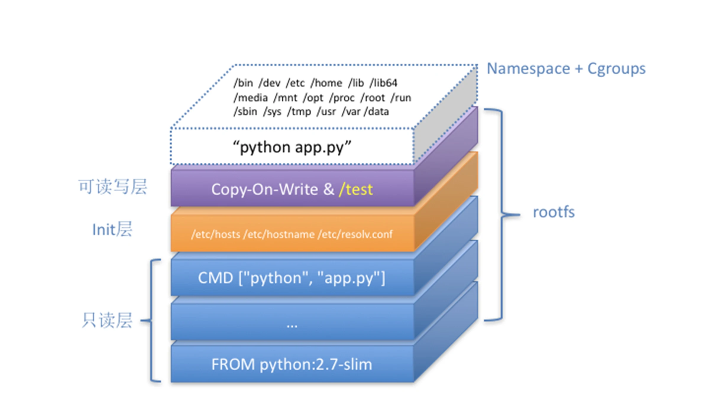

# 容器技术的演进

> 开发运维环境一共经历了四个阶段：物理机时代、虚拟机时代、容器时代和容器云时代。本文主要对这一演进过程进行简单分析，让大家对容器技术有一个普适性的了解，为后续大家进一步了解Kubernetes打下基础。

从过去以物理机和虚拟机为主体的开发运维环境，向以容器为核心的基础设施的转变过程，并不是一次温和的改革，而是涵盖了对网络、存储、调度、操作系统、分布式原理等各个方面的容器化理解和改造。

## 物理机时代

所有的运维操作都是基于一台物理机，一台物理机上会部署一个或多个应用。当时很多应用还是大的单体应用，整个服务发布一次需要很长时间，一般需要好几天。主要是像银行等金融行业大规模在使用。

### 部署架构


**优点**
* 资源独享
* 性能稳定

**缺点**
* 资源浪费，成本高
* 运维环境一致性难以保证
* 多个应用之间相互影响

## 虚拟机时代

虚拟机技术其实是通过软件的手段来虚拟硬件的一种技术，从而达到和物理机一样的体验。

### 部署架构


**优点**

* 节约成本
* 运维环境基本能保证一致
* 应用隔离

**缺点**

* 运维成本高
* 物理机资源利用率低

## 容器时代

容器其实是一种沙盒技术。顾名思义，沙盒就是能够像一个集装箱一样，把你的应用“装”起来的技术。这样，应用与应用之间，就因为有了边界而不至于相互干扰；而被装进集装箱的应用，也可以被方便地搬来搬去，这也是PaaS系统最理想的状态。

### 容器技术

* 隔离：每个容器之间相互隔离，看不到彼此
* 限制：每个容器对宿主机资源的访问都会被严格限制，其中包括：CPU、内存、磁盘、网络带宽等等

#### 操作系统支持

* Namespace 技术：是 Linux 创建新进程的一个可选参数，当我们用 clone() 系统调用创建一个新进程时，就可以在参数中指定 CLONE_NEWPID 参数，比如：

```java
int pid = clone(main_function, stack_size, CLONE_NEWPID | SIGCHLD, NULL); 
```

这时，新创建的这个进程将会“看到”一个全新的进程空间，在这个进程空间里，它的 PID 是 1，但是在宿主机真实的进程空间里，这个进程的 PID 还是真实的数值，比如 100。

而除了我们刚刚用到的 PID Namespace，Linux 操作系统还提供了 Mount、UTS、IPC、Network 和 User 这些 Namespace，用来对各种不同的进程上下文进行“障眼法”操作。

* Cgroups 技术：全称是 Linux Control Group。它最主要的作用，就是限制一个进程组能够使用的资源上限，包括 CPU、内存、磁盘、网络带宽等等。
可以在Linux系统的/sys/fs/cgroup目录下，执行mount -t cgroup命令查看各种资源的限制情况

```java
$ mount -t cgroup 
cpuset on /sys/fs/cgroup/cpuset type cgroup (rw,nosuid,nodev,noexec,relatime,cpuset)
cpu on /sys/fs/cgroup/cpu type cgroup (rw,nosuid,nodev,noexec,relatime,cpu)
cpuacct on /sys/fs/cgroup/cpuacct type cgroup (rw,nosuid,nodev,noexec,relatime,cpuacct)
blkio on /sys/fs/cgroup/blkio type cgroup (rw,nosuid,nodev,noexec,relatime,blkio)
memory on /sys/fs/cgroup/memory type cgroup (rw,nosuid,nodev,noexec,relatime,memory)
```

#### 部署架构


**优点**
* 物理机利用率高
* 敏捷
* 高性能

**缺点**
* 隔离的不彻底

#### Docker

Docker在容器技术的基础上通过不断改良Linux 操作系统里chroot 的命令来修改根目录的挂载点能力提出了Mount Namespace的功能，它也是 Linux 操作系统里的第一个 Namespace。而这个挂载在容器根目录上、用来为容器进程提供隔离后执行环境的文件系统，就是所谓的“容器镜像”。它还有一个更为专业的名字，叫作：rootfs（根文件系统）。也因为这个技术实现了容器里的应用进程，看到一份完全独立的文件系统。

##### rootfs设计


* ro+wh层：它是这个容器的 rootfs 最下面的五层，对应的正是 ubuntu:latest 镜像的五层。wh是为了实现删除操作，在可读写层创建一个 whiteout 文件，把只读层里的文件“遮挡”起来。
* init层：它是一个以“-init”结尾的层，夹在只读层和读写层之间。Init 层是 Docker 项目单独生成的一个内部层，专门用来存放 /etc/hosts、/etc/resolv.conf 等信息。
* rw层：它是这个容器的 rootfs 最上面的一层（6e3be5d2ecccae7cc），它的挂载方式为：rw，即 read write。在没有写入文件之前，这个目录是空的。而一旦在容器里做了写操作，你修改产生的内容就会以增量的方式出现在这个层中。

于此同时，社区也推出了OCI（ Open Container Initiative ）规范，意在将容器运行时和镜像的实现从 Docker 项目中完全剥离出来。

##### Dockerfile
Docker提供了一种将制作 rootfs 的过程采用文件的方式来描述的能力。这个文件就叫做Dockerfile

```java
# 使用官方提供的Python开发镜像作为基础镜像
FROM python:2.7-slim

# 将工作目录切换为/app
WORKDIR /app

# 将当前目录下的所有内容复制到/app下
ADD . /app

# 使用pip命令安装这个应用所需要的依赖
RUN pip install --trusted-host pypi.python.org -r requirements.txt

# 允许外界访问容器的80端口
EXPOSE 80

# 设置环境变量
ENV NAME World

# 设置容器进程为：python app.py，即：这个Python应用的启动命令
CMD ["python", "app.py"]
```

**注意**：Dockerfile 的设计思想，是使用一些标准的原语，描述我们所要构建的 Docker 镜像。并且这些原语，都是按顺序处理的。Dockerfile 中的每个原语执行后，都会生成一个对应的镜像层。

##### Docker容器层架构


##### Docker部署架构


##### Docker技术架构


**优点**
* 容器之间完全隔离
* 部署简单
* 物理机利用率高

**缺点**
* 容器集群管理的能力不足

## 容器云时代

容器云时代主要解决的是如何管理容器集群的问题、应用和应用之间的关系（这种表述不一定准确）。Kubernetes对这个问题提出了自己的解决方案。

### Kubernetes的架构


Kubernetes 项目的架构，由 Master 和 Node 两种节点组成，而这两种角色分别对应着控制节点和计算节点。其中，控制节点，即 Master 节点，由三个紧密协作的独立组件组合而成。

**Master**

* kube-apiserver：负责 API 服务，整个集群的持久化数据，则由 kube-apiserver 处理后保存在 Etcd 中
* kube-scheduler：负责调度
* kube-controller-manager：负责容器编排

而计算节点上最核心的部分，则是一个叫作 kubelet 的组件，主要功能如下：

**Kubelet**
* CNI：调用网络插件为容器配置网络。
* CRI：负责同容器运行时（比如 Docker 项目）打交道，这个接口定义了容器运行时的各项核心操作，比如：启动一个容器需要的所有参数。
* CSI：调用存储插件为容器持久化存储。
* Device Plugin：kubelet 还通过 gRPC 协议同一个叫作 Device Plugin 的插件进行交互。这个插件，是 Kubernetes 项目用来管理 GPU 等宿主机物理设备的主要组件，也是基于 Kubernetes 项目进行机器学习训练、高性能作业支持等工作必须关注的功能。
* OCI：容器实现规范。

### 示例
现在已经制作好了一个 Nginx 容器镜像，希望让平台帮我启动这个镜像。并且，我要求平台帮我运行两个完全相同的 Nginx 副本，以负载均衡的方式共同对外提供服务。

```java
apiVersion: apps/v1
kind: Deployment
metadata:
  name: nginx-deployment
  labels:
    app: nginx
spec:
  replicas: 2
  selector:
    matchLabels:
      app: nginx
  template:
    metadata:
      labels:
        app: nginx
    spec:
      containers:
      - name: nginx
        image: nginx:1.7.9
        ports:
        - containerPort: 80
```

**优点**
* 提供了容器编排、调度、管理的能力
* 解决了应用和应用之间的关系
* 解决应用运行形态问题


**缺点**
* Kubernetes整个服务部署复杂

## 参考文档

* https://coolshell.cn/articles/17010.html
* https://kubernetes.io/docs/concepts/overview/what-is-kubernetes/
* https://kubernetes.io/docs/concepts/overview/components/