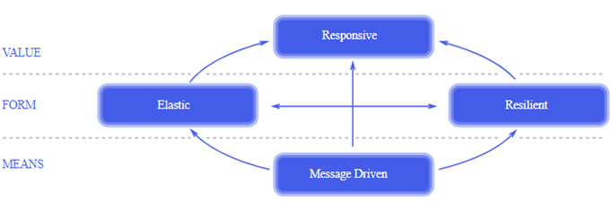
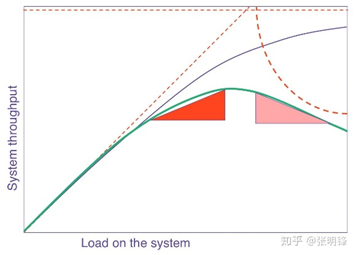
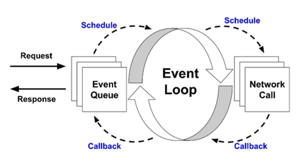
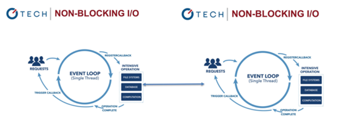

# Reactive反应式架构

### 1. 什么是Reactive？

Reactive直接翻译的意思是反应式，反应性。在前端/移动端/后端，很多东西都被称之为所谓的Reactive，那什么才是我们关注的Reactive呢？

其实反应式并不是一个新鲜的概念，它的灵感来源最早可以追溯到90年代，但是直到2013年，Roland Kuhn等人发布了《反应式宣言》后才慢慢被人熟知，继而在2014年迎来爆发式增长。回到2014年，反应式的流行其实也移动设备的发展有关，随着智能手机的普及，越来越多的终端用户使互联网系统的并发压力急速上升。同时随着微服务趋势的流行，网络成为系统架构中的一等公民，而如何降低网络IO的开销，也成为了系统建设的重点问题。又随着近几年云原生趋势的流行，云上的计算资源成本开始透明化，所以如何降低应用的成本，同时实现高性能，成为应用开发人员需要关注的问题。

Reactive其实是一个广义的范畴，一个架构可以说是Reactive的，一个系统也可以说是Reactive的，又或者编程模型代码风格也可以称为Reactive。但是Reactive有什么价值？有哪些设计原则？到底是什么？让我们以后端技术的视角，从Reactive宣言开始谈起。

#### 1.1 Reactive宣言

2013年6月，Roland Kuhn等人发布了《反应式宣言》， 该宣言定义了反应式系统应该具备的一些架构设计原则。符合反应式设计原则的系统称为反应式系统。根据反应式宣言，反应式系统需要具备即时响应性(Responsive)、回弹性(Resilient)、弹性(Elastic)和消息驱动(Message Driven)四个特质。

要理解反应式宣言，需要首先理解它的三个层次。首先第一层是VALUE价值，也就是说一个Reactive的架构它能达到的价值是什么。那要如何实现这些价值呢？这就是第二层FORM手段，我们通过这两种手段，就可以使我们的系统拥有这样的VALUE价值。最后一层是MEANS形式，也就是Reactive系统的表现形式是什么。

##### 1.1.1 VALUE-即时响应性 (Responsive)

我们知道CAP理论：一个分布式系统最多只能同时满足一致性（Consistency）、可用性（Availability）和分区容错性（Partition tolerance）这三项中的两项。而一个Reactive的系统，则宣称可以满足高吞吐量 、低延迟/顺畅无卡顿、资源占用小三者之中的两项。

> 在C10K场景下，当有海量的网络请求接入时，如果采用servler这种一个请求一个线程的模型，将会需要一个庞大的线程池，造成大量上下文切换开销和大量内存占用。 而如果线程池的线程数消费能力不足，则又会造成请求在待处理队列中的积压，导致超时或者高延时，甚至对前端失去响应性。

那问题就来了，难道以前的应用无法同时满足这三者之中的两项吗？为了具体的对比，我们在这里选取Java中经典的网络编程模型：servlet，来作为对比。

servlet是javaee的传统经典规范，旨在用多线程模型解决网络高并发的场景。那让我们来到C10K的场景，当有海量的网络请求接入时，servlet模型是怎样处理的呢？首先我们需要囤积一个很大的线程池，用于处理即将来到的请求，当请求量上升的时候，一个请求一个线程的模型将会同时启动大量的线程，假如线程池已经使用完毕，那么剩余的请求将不得不在阻塞队列中等待消费处理，甚至会造成超时等异常情况。那我们能不能启动无限的线程用于承担请求呢？线程并非轻量级资源，代价将会是大量的内存占用，以及大量的线程上下文切换开销。

分析完servlet模型之后，让我们回过头来看高吞吐量 、低延迟/顺畅无卡顿、资源占用小这三者。当试图实现高吞吐量的时候，不得不囤积一个很大的线程池用于处理请求，那么资源占用将会是很大的，同时由于线程池不能无限增长，当请求数量超过线程消费能力的时候（在高并发下这是正常的），剩余的请求将会在阻塞队列中等待，前端系统感知到的就是大量的长耗时和超时，故不能符合低延迟/顺畅无卡顿的特性。

那么Reactive的系统凭什么可以做到在高并发的时候，还可以资源占用小或者低延迟呢？那就要靠第二层，两种手段来解决这个问题了。

最后让我们再来回顾一下即时响应性 (Responsive)官方的定义：

*只要有可能， 系统就会及时地做出响应。即时响应是可用性和实用性的基石， 而更加重要的是，即时响应意味着可以快速地检测到问题并且有效地对其进行处理。即时响应的系统专注于提供快速而一致的响应时间， 确立可靠的反馈上限， 以提供一致的服务质量。这种一致的行为转而将简化错误处理、 建立最终用户的信任并促使用户与系统作进一步的互动*

什么是"只要有可能"呢，我的理解是，此时系统资源（CPU、网卡等）还未达到瓶颈，但由于我们线程池容量的限制，导致并发量上不去。当然我们也可以通过线程池调优找到最佳的线程数量，但在不同的压力下，这并不是一个固定的值。所以，当实际上系统资源并没有达到瓶颈时，瓶颈将受限于我们的线程模型。

##### 1.1.2 FROM-回弹性（Resilient）

让我们先来看一下回弹性的官方定义：

*系统在出现失败时依然能保持即时响应性， 每个组件的恢复都被委托给了另一个外部的组件， 此外，在必要时可以通过复制来保证高可用性。 因此组件的客户端不再承担组件失败的处理。*

> 反应式编程中将会强制组件考虑失败的情形，所以在真正失败发生的时候，由此构建的系统，将会对错误具有更强的承受处理能力，即更具回弹性。

这段话是什么意思？让我们从后端技术视角来试图解读一下。在网络环境中，传统RPC框架讲究的是像调用本地服务一样调用远程服务，即帮你屏蔽网络的不可靠性。而在实际的网络环境中，尤其是云原生的环境下，网络天然就是不可靠的。

Reactive说：让我们拥抱网络的不确定性吧。这就是反应式接口onError方法的由来，无论是在本地还是在网络中，reactive编程模型不会让你屏蔽失败的可能性，而是强迫你必须思考并处理失败的情形，所以在真正失败发生的时候，由此构建的系统，将会对错误具有更强的承受处理能力，即更具回弹性。

上面是我对回弹性的第一个理解，但有人可能会说，不就是一个try-catch的事情吗？在传统的编程模型中，我只要在调用的时候catch可能的异常，并加以处理，不一样可以起到相同的作用吗？是的，假设只有onError一个接口，那么两者并没有本质的不同。

但让我们思考一个集群的场景，A->B->C这样一条链路，假如上游B的生产能力非常强，超过了C的消费能力，那将会导致什么？C可能会被压垮，继而导致B->C的熔断。在经典的解决方案中，网络调用使用熔断机制来进行故障转移。当C不可用的时候，将会触发B的熔断，而B的熔断，又将回馈给上游A系统，继而造成这种错误在整条链路中的传播。

但这种传播本身并不是没有代价的，重则造成整个系统的雪崩，哪怕有兜底机制，也会造成资源的极大浪费。因为当B->C不可用时，A仍然在不停的处理上游请求，CPU大量的消耗在序列化反序列化中，当请求到达B时，才发现已经不可用了，整个上游的资源都在无谓的浪费中，严重时甚至可以挤压其他正常功能，最终造成整个服务的超载。

那Reactive有什么办法能够避免这种雪崩和资源浪费呢？其实问题的关键就在于，一条链路的处理能力，其实取决于吞吐最低的那一环，在A->B->C的过程中，AB的速度再快都没有用，反而会压垮C，那么假如我们可以将C的消费能力通知到A和B，让A和B只处理C能承受的压力，不就可以确保整条链路的健康，同时也可以避免无谓的资源消耗了吗？这就是背压的机制，reactive系统定义了背压这样一种压力反馈的交互方式，每个下游系统都把自己的消费能力通知到上游，上游将会按照这种契约把相应数量的请求给到下游，从而进行保护。

同时为了避免错误在系统中的传播，造成资源的浪费，反应式编程可以通过背压的方式对消费端起到保护作用。就如同上图一样，拥有背压机制的系统，消费端可以决定自己什么时候喝水，喝多少水。从而在下游系统遇到异常或者吞吐量跟不上的情况下，对整条链路进行保护，避免发生雪崩或者熔断，从而造成资源的浪费。

##### 1.1.3 FROM-弹性（Elastic）

反应式宣言对于弹性的定义：

*系统在不断变化的工作负载之下依然保持即时响应性。 反应式系统可以对输入负载的速率变化做出反应，比如通过横向地伸缩底层计算资源。 这意味着设计上不能有中央瓶颈， 使得各个组件可以进行分片或者复制， 并在它们之间进行负载均衡。*

比起从抽象的架构层去理解这个概念，或许我们可以从另一个更具体的技术角度去解读它。

什么是不断变化的工作负载呢？让我们回到经典的servlet模型，当请求的压力不断变化时，我们的系统是否具有弹性呢？即是否"可以对输入负载的速率变化做出反应"？上文中我们谈到过，servlet使用多线程模型解决并发问题，当请求数量小于消费线程的数量的时候，看起来并没有什么问题。

但如果我们设置的线程数量太小，那么大量的请求将会积压，实际上此时系统资源可能并没有达到瓶颈，而瓶颈在于我们的线程模型。

但当请求不断增加，我们是否可以把消费线程无限制的调高呢？答案是不行的，在JVM中一个Java线程将会映射到一个内核线程上，它将占用数百KB到数MB的内存空间，同时随着线程数量的增加，造成线程上下文切换的开销不断增加。

那么当线程数量不断增加的时候，系统的吞吐量将会怎么变化呢？

根据下图的通用伸缩性法则，N是线程的数量；α对应的是系统中的串行部分，对应到Tomcat中，我们可以理解为消费线程从阻塞队列中获取请求的部分；β是一致性系数，随着线程的增加，上下文切换不断增加，我们可以理解β一致性成本也会不断增加。所以随着线程的增加，α和β将会不断增大，最终系统的吞吐量将会像绿色曲线一样，在达到最佳线程数之后开始不断下降，这也符合我们的调优经验，即线程不能无限增加，存在最佳线程数量的限制。

所以当请求的压力大于线程池消费能力的时候，这种线程模型就不具备"在不断变化的工作负载之下依然保持即时响应性/可以对输入负载的速率变化做出反应"这样的特性。

那么reactive模型是怎么解决这个问题呢？假如可以在不断变化的输入负载下，始终以当前资源（CPU）允许的最大能力进行处理，那我们就可以不用担心瓶颈在我们应用上，当系统达到瓶颈时，那说明已经达到系统资源（CPU）的瓶颈，此时的解决方案就不再是单个应用的范围了，可采用集群横向伸缩的方式进行解决。

那如何做到这样的模型呢？根据公式，假如我们可以把α变为0，把β也变为0，那我们将会得到一条C(N)=N的曲线，即可满足我们的设想。那意味着我们的系统不能存在串行部分，也不能存在上下文切换这样无谓的CPU时间片开销。这时我们可以想到，经典的EventLoop模型，假如一个CPU只使用一个线程跑满，那不就可以避免以上的问题？所以EventLoop线程模型，就是解决系统伸缩性的线程模型。

#### 1.2 EventLoop+NIO

我们谈到网络是云原生应用开发环境中的一等公民，当我们采用EventLoop模型之后，网络IO该如何处理呢？继续使用阻塞IO，那么将会阻塞我们的EventLoop线程，整个应用就会失去响应，所以EventLoop线程模型天然的就要结合NIO来使用。这也是Reactive技术的一种具体表现形式，甚至从狭义的角度讲，如果一个应用使用了EventLoop+NIO这样的编程模型，我们就可以称它为reactive应用，因为它具备了reactive系统的几种特征。

当使用EventLoop+NIO，那么我们的单个runtime就已经具备了伸缩性和回弹性的特征，其实借助的是操作系统提供的NIO机制以及它的回调函数功能。但当我们从单个runtime拓展到整个集群，每个应用的之间该如何传递这种reactive交互的语义呢？即在多个runtime之间，该如何通过网络传递背压这样的机制。

这是reactive stream规范提出协议，而像rsocket、grpc这些网络协议，也实现了这样的规范，所以如果要在整个集群进行reactive语义的传递，我们可以依赖于使用这类网络协议。

### 2. Reactive的价值

#### 2.1 云原生下的Reactive

在前面，我们从一些比较具体的技术角度解读了reactive宣言的一些特征，也阐述了一些具体的技术原理。那么这样一种技术为什么会在后端架构中变得流行呢？它带来的价值是什么呢？其实这要从云原生开始谈起。

云原生已经成为当前技术发展的一个重要趋势，而云原生的事实标准就是K8S，当你的应用运行在K8S之上，并且你符合CNCF定义的一系列标准，那么他们就称你的应用是一个云原生应用。

我们可以把云基础设施看做一条高速公路，CNCF提供了一系列的组件能够使我们的应用跑在这条高速公路上，从这个角度来讲，云原生是底层的基础设施层，它更关注应用的外在，即运维、部署、系统级监控等等。

提到云原生和K8S，那我们就不得不提另一个云原生的支柱：Istio。Istio使用sidecar边车的设计模式，在应用的外部帮助应用处理网络请求，而sidecar也是各种云原生组件适配的方式。

但我们应用的性能提高了么？在你的摩托车外面挂上一个这样的sidecar，它只会让你的应用跑的更加平稳，但不会让你跑的更快。而应用开发人员更关注的是如何让应用跑的更快，消耗更少的CPU和更少的内存，这是云原生基础设施无法帮你做到的，甚至说云厂商希望你的应用消耗更多的资源，这样才可以赚取更高的利润。

而reactive技术，就是帮助应用更加节省资源的手段，reactive关注的是应用的内部，即通过线程模型和网络模型等手段，帮助应用更快更省以及更加强健。这就是reactive的意义。在云时代，成本以账单的形式透明存在，所以当我们的应用使用reactive技术后，可以显著的降低成本，这就是reactive流行的重要原因之一。

### 3. 使用Reactive

#### 3.1 Reactive理论模型

#### 3.2 Reactive异步编程模式

##### 3.2.2 Reactive和协程