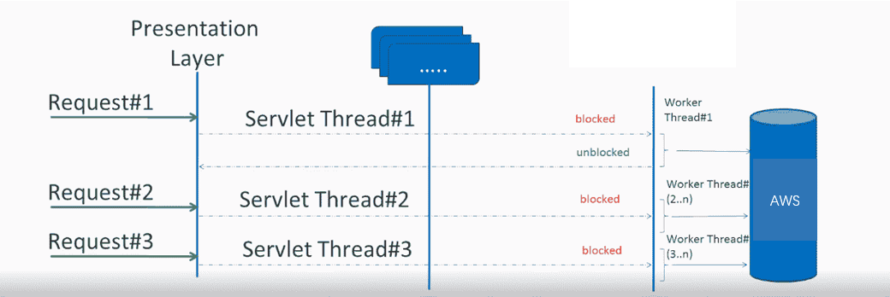
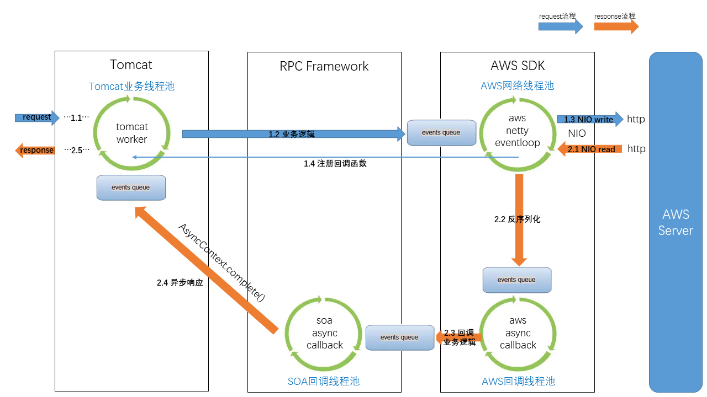
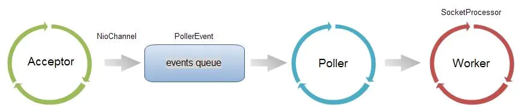
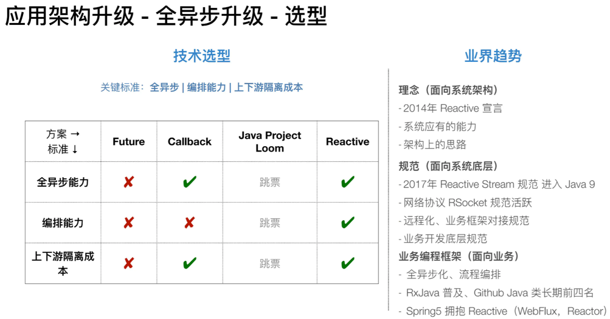

# 《Reactive模式在Trip.com消息推送平台上的实践》

### 一、背景

#### 1.1 业务需求

Trip.com消息推送平台主要负责Trip.com在海外的邮件等渠道的营销消息推送，系统整体设计为面向上游消息的流式架构，当接收到上游的请求之后，经过一系列的计算逻辑，最后将会调用下游第三方发送接口，将邮件等消息通过网络发送出去。Trip.com消息推送平台是典型的IO密集型应用。

#### 1.2 当前解决方案

Trip.com的业务层以Java技术栈为主，其中主要web服务基于同步+阻塞IO的servlet模型，也有少部分web服务基于异步servlet。servlet是经典的JavaEE解决方案，旨在用多线程模型解决IO高并发问题。这种同步编程模型的优点是开发简单，易于进行问题追踪，并且对开发人员的要求比较低，有利于业务的快速开发。



Tirp.com消息推送平台也是基于同步+阻塞IO的servlet模型架构。当客户端发起网络请求的时候，请求首先会由Tomcat容器的Acceptor线程进行处理，将Channel放到待处理请求队列然后通过Poller线程进行IO多路复用的监听，当Poller监听到Channel的可读事件后，请求体将会从缓冲区被读入内存，然后交由Tomcat容器的Worker线程池进行消费。由于需要使用阻塞IO调用下游的第三方发送接口，所以Worker线程池需要启动大量的线程进行并发操作，根据Tomcat配置文件，最多可能启动1024个worker线程。

```xml
<!-- 最大线程数1024，在极端情况下，最高可能启动1024个线程 -->
<Connector port="${port.http.server}" protocol="org.apache.coyote.http11.Http11NioProtocol" minSpareThreads="20" maxThreads="1024"/>
```

**代码示例**

Trip.com消息推送平台使用AWS的SES服务进行邮件发送，在发送Email时将会调用AWS的同步SDK:

```java
SendEmailResult sendEmail(SendEmailRequest sendEmailRequest);
```

而AWS的同步SDK使用的是apache的`HttpClient`，底层采用的BIO模式将会阻塞当前线程直到会话缓冲区有数据到达或到达超时时间。

### 二、存在的问题

而随着业务量上涨带来上游消息负载增加，原有的阻塞IO模型在高并发下，会有大量线程处于阻塞状态，导致应用需要囤积大量的线程以应对峰值压力。过多的线程将会造成大量的内存占用和频繁线程上下文切换的开销，所以原有的servlet线程模型具有CPU利用率低、内存占用大、对异常请求不具备弹性等缺点。该平台在压力峰值时需要部署大量机器，它主要具有以下性能上的问题：

#### 2.1 线程上下文切换开销

一次请求的IO时间平均在1200ms，最高能达到50000ms，而计算时间只有1~2ms，根据最佳线程公式理论上1C需要600~2500个线程。囤积如此多的线程将会造成大量的上下文切换开销和上GB的内存占用。但若是使用少量的线程，将可能由于线程数量的限制，导致请求量过高时拿不到处理线程，最终请求超时，不具备低延迟等特性。

#### 2.2 部署成本高

若是采用主流的2C4G容器配置，理论上将需要1000+的线程用于处理请求，这将占用大概1GB的内存空间。同时若并发请求数>线程数时，需要采用水平扩容增加服务的吞吐量，所以服务需要按照峰值并发进行预估部署，造成空闲时间大量资源的浪费。

#### 2.3 超时风险

一次IO最高能达到50s，当有异常请求导致响应时间突增时，因为会阻塞线程，导致线程池中的线程大部分都被阻塞，从而无法响应新的请求。在这种情况下，少量的异常请求将会导致上游大量的超时报错，因此服务不具有弹性。


### 三、解决方案

面对传统BIO模式在IO密集型场景下的缺点，借助NIO和多路复用技术可解决上述BIO问题，目前Java项目对接NIO的方式主要依靠回调，代码复杂度高，降低了代码可读性与可维护性。随着Reactive反应式架构的流行，业界有一些公司开始推动服务的全异步升级，开始采用Reactive架构来解决此类问题。而Trip.com也开始逐渐重视服务网络IO的性能问题，已有部分团队开始进行Reactive实践。

Reactive 构建的程序代表的是异步非阻塞、函数式编程、事件驱动的思想。随着近年来Reactive编程模式的发展，能达到高性能与可读性的兼顾。Trip.com消息推送平台利用Reactive相关技术对系统进行异步非阻塞IO改造，主要希望达到以下两个目标：

1）提升单机的吞吐量，提高有效CPU使用率、降低内存占用、保证业务请求突增时系统的可伸缩性，最终降低硬件成本。

2）使用Reactive编程模型，替代处理NIO常用的异步回调模式，积累对同步阻塞应用进行异步非阻塞化升级的重构经验。

#### 3.1 什么是Reactive？

> 反应式宣言：来自不同领域的组织正在不约而同地发现一些看起来如出一辙的软件构建模式。它们的系统更加稳健，更加有可回复性，更加灵活，并且以更好的定位来满足现代的需求。这些变化之所以会发生，是因为近几年的应用需求出现了戏剧性的变化。仅仅在几年之前，大型应用意味着数十台服务器，数秒的响应时间，数小时的离线维护时间以及若干GB的数据。而在今天，应用被部署在一切场合，从移动设备到基于云的集群，这些集群运行在数以千计的多核心处理器的之上。用户期望毫秒级的响应时间以及100%的正常运行时间。数据则以PB为单位来衡量。
>
> 昨天的软件架构已经完全无法地满足今天的需求。我们相信，一种条理分明的系统架构方法是必要的，而且我们相信关于这种方法的所有必要方面已经逐一地被人们认识到：我们需要的系统是反应式的，具有可回复性的，可伸缩的，以及以消息驱动的。我们将这样的系统称之为反应式系统。以反应式系统方式构建的系统更加灵活，松耦合和可扩展。这使得它们更容易被开发，而且经得起变化的考验。它们对于系统失败表现出显著的包容性，并且当失败真的发生时，它们能用优雅的方式去应对，而不是放任灾难的发生。反应式系统是高度灵敏的，能够给用户以有效的交互式的反馈。

**Reactive宣言**


2013年6月，Roland Kuhn等人发布了《反应式宣言》， 该宣言定义了反应式系统应该具备的一些架构设计原则。符合反应式设计原则的系统称为反应式系统。根据反应式宣言，反应式系统需要具备即时响应性(Responsive)、回弹性(Resilient)、弹性(Elastic)和消息驱动(Message Driven)四个特质。

**VALUE-即时响应性 (Responsive)**

*只要有可能，系统就会及时地做出响应。即时响应是可用性和实用性的基石，而更加重要的是，即时响应意味着可以快速地检测到问题并且有效地对其进行处理。即时响应的系统专注于提供快速而一致的响应时间，确立可靠的反馈上限，以提供一致的服务质量。这种一致的行为转而将简化错误处理、建立最终用户的信任并促使用户与系统作进一步的互动*

反应式系统具备及时响应性，可以提供快速的响应时间，在错误发生时也会保持响应性。

**FORM-回弹性（Resilient）**

*系统在出现失败时依然能保持即时响应性，每个组件的恢复都被委托给了另一个外部的组件，此外，在必要时可以通过复制来保证高可用性。因此组件的客户端不再承担组件失败的处理。*

反应式系统通过背压等特性避免错误在系统中的传播，所以在失败发生的时候，反应式系统将会对错误具有更强的承受处理能力。背压是reactive stream定义的规范，可以使用rsocket、grpc这类网络协议实现背压的机制。

**FORM-弹性（Elastic）**

*系统在不断变化的工作负载之下依然保持即时响应性。反应式系统可以对输入负载的速率变化做出反应，比如通过横向地伸缩底层计算资源。这意味着设计上不能有中央瓶颈，使得各个组件可以进行分片或者复制，并在它们之间进行负载均衡。*

反应式系统的瓶颈不在于线程模型，在不同的工作负载下，使用EventLoop线程模型将始终提供CPU资源允许的计算能力，当达到计算能力瓶颈时可以横向拓展CPU计算资源。反应式系统通过EventLoop+NIO模型，避免线程的上下文开销，同时也避免线程池资源的大小成为系统的瓶颈。


#### 3.2 使用Reactive技术进行重构

3.1章节我们谈论了Reactive理论模型，以及它的部分技术原理。现在，我们要使用Reactive技术重构Trip.com消息发送平台。根据reactive思想的指导，对于IO密集型应用，我们可以采用EventLoop+NIO的方式对传统的同步阻塞IO模型进行优化。

在整个系统中，首先介绍三个主要的中间件：

1. Tomcat：网络中间件，负责接收和响应网络请求
2. RPC Framework（soa）：Trip.com集团的RPC框架，提供了同步和异步两种服务模式
3. AWS SDK：使用AWS的异步SDK，通过NIO调用AWS服务

##### 3.2.1 线程模型设计

在原同步版本中，首先使用Tomcat的Worker线程接收和处理request并执行同步逻辑，而后通过AWS的同步SDK进行BIO调用，此时worker线程将会block在IO调用上。当网络IO响应时，该worker线程将被唤醒，拿到response并执行响应逻辑。同步阻塞的线程模型是比较简单的，worker线程基本负责了整个流程。

而采用EventLoop+NIO的异步非阻塞模式，将会无可避免的引入回调函数，为了回调流程的逻辑清晰和故障隔离等功能考虑，将会引入几组不同的回调线程池，来负责不同模块的回调逻辑。

整个异步流程的线程模型设计如图所示：



**request流程：**

**1.1** 使用Tomcat接收和处理网络请求

使用Tomcat的Acceptor线程接收socket连接事件，然后封装成NioChannel压入events queue中。然后Poller线程通过Selector获取到可读的socket，并传递给Worker线程进行处理。该部分与原版本的同步模型相同，Tomcat线程模型如下图所示：



**1.2** 业务逻辑处理部分

Tomcat的Worker线程将负责执行同步逻辑，worker线程将会依次同步执行Tomcat逻辑、RPC Framework逻辑、业务逻辑、AWS SDK逻辑。

Worker线程执行完同步逻辑之后，将会把封装好的request放入EventLoop的events queue中，等待EventLoop的处理。

**1.3** AWS SDK NIO异步处理

AWS的异步SDK，使用Netty进行网络IO的传输，其内部会内置一个Netty的EventLoop线程池，负责网络IO的序列化反序列化。AWS的EventLoop线程池定义如下，使用的是Netty的`NioEventLoopGroup`：

```java
int numThreads = Optional.ofNullable(builder.numberOfThreads).orElse(0);
ThreadFactory threadFactory = Optional.ofNullable(builder.threadFactory)
                                      .orElse(new ThreadFactoryBuilder()
                                      .threadNamePrefix("aws-java-sdk-NettyEventLoop")
                                      .build());
return new NioEventLoopGroup(numThreads, threadFactory);
```

**1.4** 注册回调函数

①channelFuture注册回调

Netty使用NIO进行网络传输，并将对应回调函数注册到对应的channelFuture上。

②AWS SDK注册回调

将channelFuture对应的Promise转换成`CompletableFuture`，AWS SDK通过`CompletableFuture.whenCompleteAsync`方法将回调函数提交给`futureCompletionExecutor`线程池。

```java
responseHandlerFuture.whenCompleteAsync((r, t) -> {
    if (t == null) {
        responseFuture.complete(r);
    } else {
        responseFuture.completeExceptionally(t);
    }
}, futureCompletionExecutor);
```

`futureCompletionExecutor`线程池的设置如下，为上图中的AWS SDK内置的回调线程池。

```java
int processors = Runtime.getRuntime().availableProcessors();
int corePoolSize = Math.max(8, processors);
int maxPoolSize = Math.max(64, processors * 2);
ThreadPoolExecutor executor = new ThreadPoolExecutor(corePoolSize, maxPoolSize,
                                                     10, TimeUnit.SECONDS,
                                                     new LinkedBlockingQueue<>(1_000),
                                                     new ThreadFactoryBuilder()
                                                         .threadNamePrefix("sdk-async-response")
                                                         .build());
```

③业务逻辑注册回调

AWS使用`futureCompletionExecutor`线程池执行回调逻辑，业务逻辑使用Reactor的`Mono`异步编程模型（3.2.3章节介绍），所以需要将AWS的`CompletableFuture`响应转换为`Mono`：

```java
Mono<SendEmailResponse> responseMono = Mono.fromCompletionStage(() -> {
    CompletableFuture<SendEmailResponse> responseFuture = sesAsyncClient.sendEmail(sendEmailRequest);
    return responseFuture;
});
```

在业务逻辑代码中，使用`Mono`进行Reactive风格的异步编程。最后，由于Trip.com的RPC Framework在异步编程模型中仅支持`ListenableFuture`，所以我们需要将业务代码中的`Mono`Future类型转换为`ListenableFuture`类型，并返回给RPC Framework，在这里我们使用`Mono.subscribe()`方法：

```java
SettableFuture listenableFuture = SettableFuture.create();
responseMono.subscribe(
        response -> listenableFuture.set(response),
        throwable -> listenableFuture.setException(throwable));
return listenableFuture;
```

④RPC Framework注册回调

当RPC Framework接收到一个异步调用结果`ListenableFuture`后，将会通过`addListener()`方法注册RPC Framework层级的回调函数：

```java
responseFuture.addListener(() -> {...}, rpcExecutorService);
```

在这里RPC Framework使用了自己定义的回调线程池`rpcExecutorService`，即上图中的SOA回调线程池：

```java
ThreadPoolConfig config = threadPoolConfigProvider.getThreadPoolConfig(key);
rpcExecutorService = new RpcExecutorService(config.taskWrapper(), new ThreadPoolExecutor(
        config.corePoolSize(),
        config.maximumPoolSize(),
        config.keepAliveTimeInMills(),
        TimeUnit.MILLISECONDS,
        config.workQueue(),
        config.threadFactory(),
        config.rejectedExecutionHandler()
));
```


>  至此，异步回调的链路组装完成。等待NIO收到响应的时候，将会依次触发上面的回调函数，进行响应流程的处理。

**response流程：**

**2.1** AWS SDK Netty响应

当netty收到IO响应数据之后，对应的EventLoop线程将会处理可读事件并执行回调函数。EventLoop首先会读取缓冲区中的数据并进行反序列化，而后执行channel的pipeline，将反序列化后的response传递给下一流程。

**2.2** AWS SDK 异步回调

AWS SDK使用1.4中提到的AWS回调线程池，进行回调逻辑的处理。AWS SDK的回调函数主要负责AWS内置的response处理，例如AWS的监控、埋点、日志等。

**2.3** 业务逻辑的异步回调

当AWS的异步回调流程完成之后，回调线程将会进入我们的业务代码注册的回调函数中，此时线程是1.4中定义的`sdk-async-response`线程。在业务逻辑的回调响应中，我们可以定义自己的业务回调线程池进行处理，也可以直接使用AWS的回调线程进行处理。由于操作非常轻量，所以在这里我们没有再额外定义一个业务回调线程池，而是直接使用了1.4中的线程池，减少了一次线程切换的开销。

**2.4** RPC Framework的异步回调

如1.4所述，当业务回调逻辑全部执行完毕之后，将会触发`ListenableFuture`的回调流程，此时进入RPC Framework这一层的回调逻辑处理。首先由`aws-async-callback`线程继续进行同步处理，而后将会把`(ListenableFuture)responseFuture`中的回调函数提交给`rpcExecutorService`线程池处理。在RPC Framework的回调函数中，将会执行RPC的监控、埋点等功能（可参考dubbo），最终将会把异步响应传递给Tomcat。

Servlet3.0提供了`AsyncContext`用来支持异步处理请求。RPC Framework在异步请求处理开始的时候，将会通过`servletRequest.startAsync()`获取对应的`AsyncContext`对象，此时既不关闭响应流也不进行响应的返回。当RPC Framework执行完所有的异步回调逻辑之后，此时`rpcExecutorService`线程将会调用`asyncContext.complete()`将上下文传递给Tomcat容器：

```java
finally {
    try {
        ......
        asyncContext.complete();
    } catch (Throwable e) {
        ......
    }
}
```


**2.5** Tomcat的异步响应

`asyncContext.complete()`使Tomcat容器接收到`ASYNC_COMPLETE`事件，在`NioEndpoint.processSocket()`方法中，将会通过`Executor executor = getExecutor();`操作获取到Worker线程池（注①），而后`rpcExecutorService`线程把响应操作写入到Worker线程池的events queue中，之后worker线程将响应流写回客户端（注②）。

```java
public boolean processSocket(SocketWrapperBase<S> socketWrapper,
        SocketEvent event, boolean dispatch) {
    try {
        if (socketWrapper == null) {
            return false;
        }
        SocketProcessorBase<S> sc = null;
        if (processorCache != null) {
            sc = processorCache.pop();
        }
        if (sc == null) {
            sc = createSocketProcessor(socketWrapper, event);
        } else {
            sc.reset(socketWrapper, event);
        }
        // 注①
        Executor executor = getExecutor();
        if (dispatch && executor != null) {
            // 注②
            executor.execute(sc);
        } else {
            sc.run();
        }
    } catch (RejectedExecutionException ree) {
        getLog().warn(sm.getString("endpoint.executor.fail", socketWrapper) , ree);
        return false;
    } catch (Throwable t) {
        ExceptionUtils.handleThrowable(t);
        // This means we got an OOM or similar creating a thread, or that
        // the pool and its queue are full
        getLog().error(sm.getString("endpoint.process.fail"), t);
        return false;
    }
    return true;
}
```


> 至此，响应流写回客户端，整个请求-响应过程完成。

##### 3.2.2 异步线程模型总结

如3.2.1所述，为了实现异步非阻塞的流程，不仅需要Tomcat的Worker线程池，还需要引入两个回调线程池和一个Netty的EventLoop线程池。

其中一个是AWS异步SDK的回调线程池，主要负责AWS功能的处理，使用的异步编程模型是`CompletableFuture`；另外一个是RPC Framework的回调线程池，主要是封装了Servlet3.0的AsyncContext并提供异步服务的能力，使用的异步编程模型是`ListenableFuture`。

而我们的业务代码使用了Reactor的`Mono`异步编程模型，所以需要涉及不同Future类型的转换，通过Reactor丰富的操作符，我们可以很容易的做到这一点。

**预期达到的效果**

使用NIO方式发起AWS的调用，避免线程阻塞，从而最大限度的消除上述BIO缺点，提高系统性能。最终使得应用符合Reactive架构理念，从而具备弹性、容错性，以降低部署成本，提高资源利用率。

##### 3.2.3 NIO异步编程模型选择

NIO 消除了线程的同步阻塞，意味着只能异步处理IO的结果，这与业务开发者顺序化的思维模式有一定差异。当业务逻辑复杂以及出现多次远程调用的情况下，多级回调难以实现和维护。

AWS原生异步SDK的调用模式如下，使用了Java8的组合式异步编程`CompletableFuture`：

```java
default CompletableFuture<SendEmailResponse> sendEmail(SendEmailRequest sendEmailRequest)
```



设计NIO编码，业界主流的编码方式主要有以上几种，通过`CompletableFuture`和Lambda表达式，可以快速实现轻量业务异步封装与编排，与Callback相比可以避免方法多层嵌套问题，但面对相对复杂业务逻辑时仍存在以下局限：

- 难以简单优雅实现多异步任务编排；
- 难以处理实时流式场景；
- 难以支持高级异常处理；
- 不支持任务延迟执行。

使用Reactive模型能够解决上述Future的局限。例如，使用Reactor封装AWS的异步调用：

```java
// sending with async non-blocking io
return Mono
        .fromCompletionStage(() -> {
            // 注①
            CompletableFuture<SendEmailResponse> responseFuture = awsAsyncClient.sendEmail(sendEmailRequest);
            return responseFuture;
        })
        // 注② thread switching: callback executor
        // .publishOn(asyncResponseScheduler)
        // 注③ callback: success
        .map(response -> this.onSuccess(context, response))
        // 注④ callback: failure
        .onErrorResume(throwable -> {
            return this.onFailure(context, throwable);
        });
```

> ①调用AWS的异步SDK，将返回的`CompletableFuture`转成的`Mono`。
>
> ②如2.3所述，可以使用`Mono.publishOn()`将业务逻辑的回调函数放入自定义的线程池执行，也可以继续使用AWS的回调线程继续执行，在这里没有使用自定义的线程池。
>
> ③如果执行成功，则执行`map()`中的回调方法
>
> ④如果执行抛出异常，则执行`onErrorResume()`中的回调方法

从上面简单对比可以看出，相比Future，基于Reactive模型丰富的操作符组合（filter/map/flatMap/zip/onErrorResume等高阶函数）代码清晰易读，搭配Lamda可以轻松实现复杂业务场景任务编排。

**Reactor异步原理**

`reactor-core`是一层编程框架，它提供的是reactive风格的编程模式，以及异步调用的编排能力。而本身并没有真正网络IO异步回调的功能，真正的异步回调功能是底层网络IO框架的Future提供，比如上面AWS返回的`CompletableFuture`才是真实绑定到网络IO上的Future，而Reactor仅仅是将其包装，方便进行reactive编程。

从`fromCompletionStage`方法中可以找到，这里将实际的`CompletionStage`包装成了`MonoCompletionStage`（注①），但在实际订阅的时候，其实是将`Mono`的回调函数放入了`future.whenComplete`中（注②），所以说`Mono`在这里是`CompletableFuture`的外层包装。

```java
final class MonoCompletionStage<T> extends Mono<T>
        implements Fuseable, Scannable {

    static final Logger LOGGER = Loggers.getLogger(MonoCompletionStage.class);

    // 注①
    final CompletionStage<? extends T> future;

    MonoCompletionStage(CompletionStage<? extends T> future) {
        this.future = Objects.requireNonNull(future, "future");
    }

    @Override
    public void subscribe(CoreSubscriber<? super T> actual) {
        Operators.MonoSubscriber<T, T>
                sds = new Operators.MonoSubscriber<>(actual);

        actual.onSubscribe(sds);

        if (sds.isCancelled()) {
            return;
        }

        // 注②
        future.whenComplete((v, e) -> {
            if (sds.isCancelled()) {
                //nobody is interested in the Mono anymore, don't risk dropping errors
                Context ctx = sds.currentContext();
                if (e == null || e instanceof CancellationException) {
                    //we discard any potential value and ignore Future cancellations
                    Operators.onDiscard(v, ctx);
                }
                else {
                    //we make sure we keep _some_ track of a Future failure AFTER the Mono cancellation
                    Operators.onErrorDropped(e, ctx);
                    //and we discard any potential value just in case both e and v are not null
                    Operators.onDiscard(v, ctx);
                }

                return;
            }
            try {
                if (e instanceof CompletionException) {
                    actual.onError(e.getCause());
                }
                else if (e != null) {
                    actual.onError(e);
                }
                else if (v != null) {
                    sds.complete(v);
                }
                else {
                    actual.onComplete();
                }
            }
            catch (Throwable e1) {
                Operators.onErrorDropped(e1, actual.currentContext());
                throw Exceptions.bubble(e1);
            }
        });
    }

    @Override
    public Object scanUnsafe(Attr key) {
        return null; //no particular key to be represented, still useful in hooks
    }
}
```


使用Reactor还有另外一个好处，那就是统一异步编程模型。比如有的异步编程框架提供`ListenableFuture`，有的是`CompletableFuture`，还有`gRPC`、`dubbo`、`webflux`等中间件框架，都提供了自己的异步编程模型实现。如果直接针对各个框架自己的原生实现进行异步编程，将会存在不同风格的代码。而`Reactor`是反应式库的当前标准，使用`Reactor`库可以封装不同异步编程框架的异构实现，使用统一的API执行异步编程。


### 四、压测对比

通过一系列的Reactive技术改造，我们现在已经拥有了一个基于EventLoop+NIO的IO密集型应用，那么它的性能是否如同我们的理论推导一样将会得到提升呢？接下来我们将会通过一系列的性能压测，得到最终的结论。

**压测目标：**

1. 是否能够达到稳定状态，以及达到稳定状态后，系统表现和指标
2. 对两个应用在不同压力下的指标，进行全面的对比，得出压测结论

**以下数据均为"稳态"时数据，稳态定义如下：**

| 指标    | 稳态数值             | 说明      |
| :------ | :------------------- | :-------- |
| **CPU** | **60%**              |           |
| **RT**  | 无明显上升           | 采用P95线 |
| **GC**  | 无FullGC，无明显上升 |           |

#### 压测结果

当原应用和新应用都达到上述定义的稳态条件时，我们得到了一组对比数据。通过与原应用的压力测试结果对比，我们发现使用EventLoop+NIO的新应用，在相同硬件资源下，QPS能够提升2~3倍，RT缩短近50%，同时在内存占用上也得到了一定的优化。证明该应用在经过Reactive技术改造后，性能较之前同步阻塞的Servlet架构得到了明显提升。
 

### 五、总结和展望

在本文中我们首先介绍了Trip.com消息推送平台服务的现状，以及现有同步+阻塞模式在IO密集型场景下的缺点。接下来我们通过分析如何解决这些缺点，引入了业界流行的reactive反应式架构。接下来在reactive宣言的弹性和伸缩性两种手段中，总结出了EventLoop、NIO、背压等技术手段，最后通过这些具体的技术手段来实现我们应用的升级重构。最终根据压测结果，可以看到服务性能较之前servlet架构得到了明显提升。

随着云原生浪潮的到来以及物联网、边缘计算的推进，未来应用间网络通讯的量级将会变得越来越庞大，网络IO会是系统架构中的一等公民。如何使我们的应用能够具有更高的性能和更健壮的特性，以及如何降低硬件资源的成本，这些挑战将促使应用开发人员不断的学习实践类似reactive相关的技术。而在学习实践的过程中，对经典的servlet架构的优化重构一定是具有代表性意义的。

在适合的业务场景下，反应式技术架构能够有效提升服务吞吐能力，降低业务编排复杂度，帮助构建云原生时代整体系统快速即时反应能力。但同时构建 Reactive 模式的程序也为开发者带来更高的要求，面临比同步更为复杂的编程模型，需要更好的处理好阻塞和写出更优秀的异步代码。希望与对反应式技术感兴趣的同学和团队多多交流。

#### 【参考文档】

[[1] 高德云图异步反应式技术架构探索和实践](https://mp.weixin.qq.com/s?__biz=Mzg4MzIwMDM5Ng==&mid=2247485086&idx=1&sn=cde9445ec0669df16bc1f53db2c3d186&chksm=cf4a5e7df83dd76b04d4c212d20ff739d1a076b515ecd24804b40fd4d543a373505b7dad55a0&scene=0&xtrack=1&key=3ddf0cf622fa72abbf1b614ba595e66943e6aad6836865920b90278c5f0d81235d5272599b99860befaa11bcb5626e6e03fdf39b578b35d5d13db89756b831e9de613e3b283dd4ed1ceccbcda480df15&ascene=1&uin=MjA0NTE5Njk0Mg%3D%3D&devicetype=Windows+10+x64&version=62090523&lang=zh_CN&exportkey=AfGngcXiCj7WgIrmGwSheZo%3D&pass_ticket=IIrtx3qfChenANA%2BVbbiNlVbr%2BKuqUloZWqsjw549hwr5BrO2dPXHYWanBYvRXjB)

[[2] Reactive架构才是未来](https://mp.weixin.qq.com/s/01SQuSYkNSHQz-0cbxzh_g)

[[3] 全面异步化：淘宝反应式架构升级探索](https://www.infoq.cn/article/2uphtmd0poeunmhy5-ay)

[[4] 淘宝应用架构升级——反应式架构的探索与实践](https://time.geekbang.org/dailylesson/detail/100033220)

[[5] 高性能Java应用层网关设计实践](https://cloud.tencent.com/developer/article/1683383)

#### 团队招聘信息

我们是Trip.com国际事业部研发团队，主要负责集团国际化业务在全球的云原生化开发和部署，直面业界最前沿的技术挑战，致力于引领集团技术创新，赋能国际业务增长，带来更极致的用户体验。

团队怀有前瞻的技术视野，积极拥抱开源建设，紧跟业界技术趋势，在这里有浓厚的技术氛围，你可以和团队成员一同参与开源建设，深入探索和交流技术原理，也有技术实施的广阔场景。

我们长期招聘有志于技术成长、对技术怀有热忱的同学，如果你热爱技术，无惧技术挑战，渴望更大的技术进步，Trip.com国际事业部期待与您的相遇。

目前我们后端/前端/测试开发/安卓，岗位都在火热招聘。简历投递邮箱：**tech@trip.com**，邮件标题：【姓名】-【携程国际业务研发部】- 【投递职位】

#### 作者简介

KevinTen，携程后端开发工程师，关注Reactive和RPC领域，深度参与开源社区，对Reactive技术有浓厚兴趣。

Pin，携程技术专家，Apache Dubbo贡献者，关注RPC、Service Mesh和云原生领域。