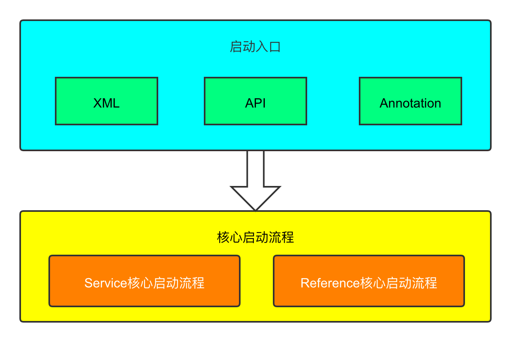
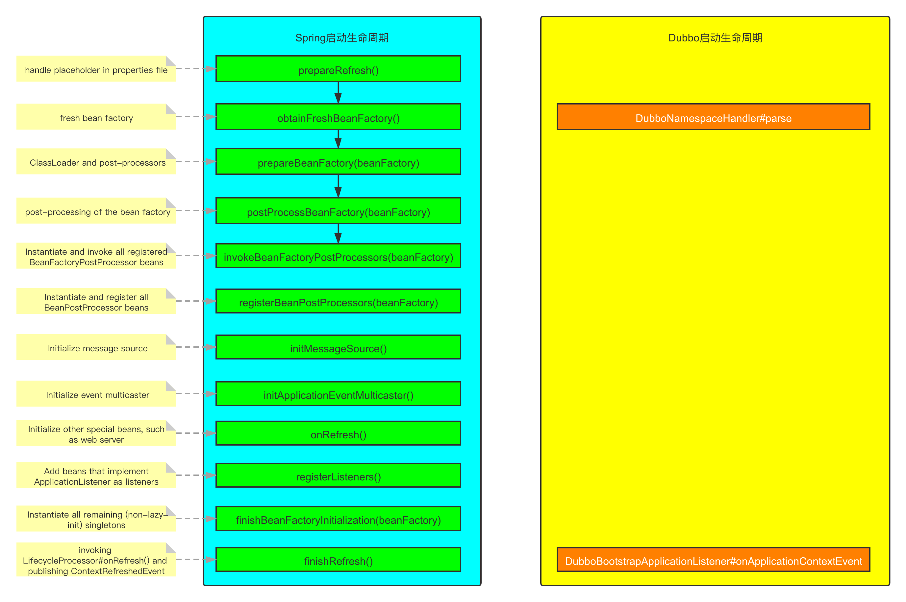
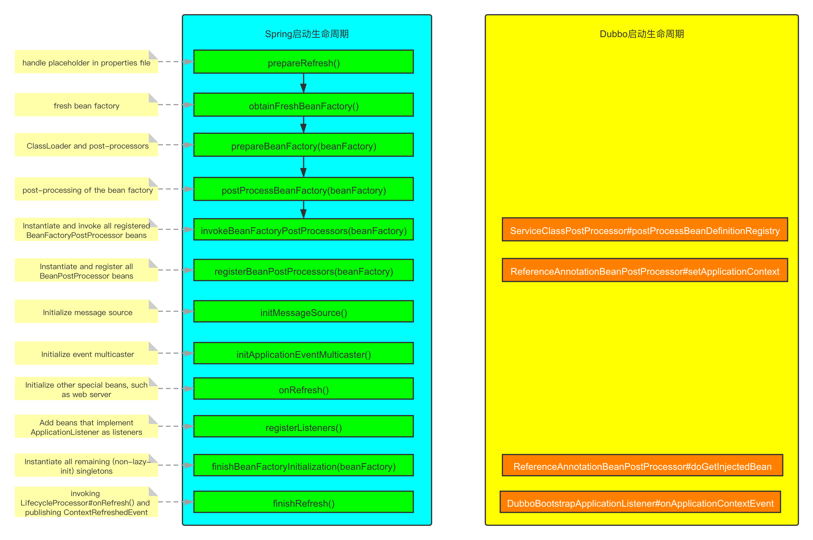
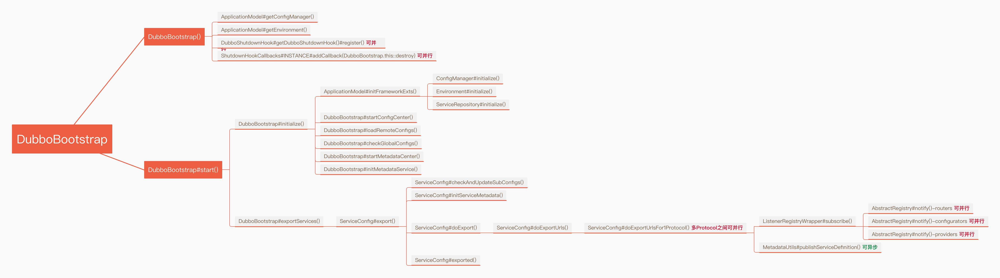
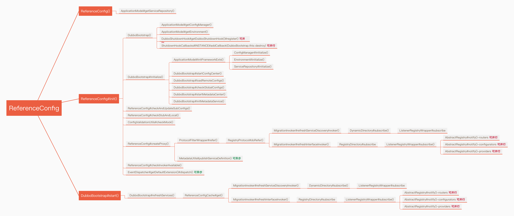

# dubbo的启动流程
> 最近有人在Dubbo社区中反馈Dubbo的启动耗时特别长，消费端订阅了265个Dubbo服务，花了近4分钟。为了解决这个问题，对整个Dubbo的启动流程进行了梳理。

从整体上来看Dubbo的启动流程一共分为两个部分，见下图：

本文将重点从以上两个部分来讲述Dubbo的整个启动流程。
## 启动入口
Dubbo常用的启动入口分为3种方式，分别是XML方式、API方式和Annotation方式。
+ XML方式

    为了更好的讲清楚这部分的内容，将其细分为3部分：
    * Spring与Dubbo基于XML的初始化流程

    XML方式在设计之初就已经和Spring的整个Bean生命周期进行了整合，我们可以通过对照Spring中Bean的生命周期来看看Dubbo是如何嵌入进来的
    

    * Dubbo中XML初始化实现细节
    具体聚焦到Dubbo的内部实现，通过调用关系可以更加详细的了解到具体的实现细节
    ``` java
        org.apache.dubbo.config.spring.schema.DubboNamespaceHandler.parse()
        ├─ org.springframework.beans.factory.xml.NamespaceHandlerSupport.parse()
        │   └─ org.apache.dubbo.config.spring.schema.DubboBeanDefinitionParser.parse()
        │       └─ org.apache.dubbo.config.spring.schema.DubboBeanDefinitionParser.parse()
        └─ org.apache.dubbo.config.spring.beans.factory.config.ConfigurableSourceBeanMetadataElement.setSource()

    ```
    
    * Dubbo中部分代码片段
        - DubboNamespaceHandler
        ```java
        public void init() {
            registerBeanDefinitionParser("application", new DubboBeanDefinitionParser(ApplicationConfig.class, true));
            registerBeanDefinitionParser("module", new DubboBeanDefinitionParser(ModuleConfig.class, true));
            registerBeanDefinitionParser("registry", new DubboBeanDefinitionParser(RegistryConfig.class, true));
            registerBeanDefinitionParser("config-center", new DubboBeanDefinitionParser(ConfigCenterBean.class, true));
            registerBeanDefinitionParser("metadata-report", new DubboBeanDefinitionParser(MetadataReportConfig.class, true));
            registerBeanDefinitionParser("monitor", new DubboBeanDefinitionParser(MonitorConfig.class, true));
            registerBeanDefinitionParser("metrics", new DubboBeanDefinitionParser(MetricsConfig.class, true));
            registerBeanDefinitionParser("ssl", new DubboBeanDefinitionParser(SslConfig.class, true));
            registerBeanDefinitionParser("provider", new DubboBeanDefinitionParser(ProviderConfig.class, true));
            registerBeanDefinitionParser("consumer", new DubboBeanDefinitionParser(ConsumerConfig.class, true));
            registerBeanDefinitionParser("protocol", new DubboBeanDefinitionParser(ProtocolConfig.class, true));
            registerBeanDefinitionParser("service", new DubboBeanDefinitionParser(ServiceBean.class, true));
            registerBeanDefinitionParser("reference", new DubboBeanDefinitionParser(ReferenceBean.class, true));
            registerBeanDefinitionParser("annotation", new AnnotationBeanDefinitionParser());
        }
        ```

        - DubboBeanUtils
        ```java
        public static void registerCommonBeans(BeanDefinitionRegistry registry) {

            // Since 2.5.7 Register @Reference Annotation Bean Processor as an infrastructure Bean
            registerInfrastructureBean(registry, ReferenceAnnotationBeanPostProcessor.BEAN_NAME,
                        ReferenceAnnotationBeanPostProcessor.class);

            // Since 2.7.4 [Feature] https://github.com/apache/dubbo/issues/5093
            registerInfrastructureBean(registry, DubboConfigAliasPostProcessor.BEAN_NAME,
                        DubboConfigAliasPostProcessor.class);

            // Since 2.7.9 Register DubboApplicationListenerRegister as an infrastructure Bean
            // https://github.com/apache/dubbo/issues/6559

            // Since 2.7.5 Register DubboLifecycleComponentApplicationListener as an infrastructure Bean
            // registerInfrastructureBean(registry, DubboLifecycleComponentApplicationListener.BEAN_NAME,
            //        DubboLifecycleComponentApplicationListener.class);

            // Since 2.7.4 Register DubboBootstrapApplicationListener as an infrastructure Bean
            // registerInfrastructureBean(registry, DubboBootstrapApplicationListener.BEAN_NAME,
            //        DubboBootstrapApplicationListener.class);

            registerInfrastructureBean(registry, DubboApplicationListenerRegistrar.BEAN_NAME,
                        DubboApplicationListenerRegistrar.class);

            // Since 2.7.6 Register DubboConfigDefaultPropertyValueBeanPostProcessor as an infrastructure Bean
            registerInfrastructureBean(registry, DubboConfigDefaultPropertyValueBeanPostProcessor.BEAN_NAME,
                        DubboConfigDefaultPropertyValueBeanPostProcessor.class);

            // Since 2.7.9 Register DubboConfigEarlyInitializationPostProcessor as an infrastructure Bean
                registerInfrastructureBean(registry, DubboConfigEarlyInitializationPostProcessor.BEAN_NAME,
                        DubboConfigEarlyInitializationPostProcessor.class);
        }

        ```

+ API方式
    API方式是最简单的，我们可以参考Dubbo中的demo，具体如下：

    * Provider
    ```java
    ServiceConfig<DemoServiceImpl> service = new ServiceConfig<>();
    service.setInterface(DemoService.class);
    service.setRef(new DemoServiceImpl());
    // 创建DubboBootstrap实例
    DubboBootstrap bootstrap = DubboBootstrap.getInstance();
    bootstrap.application(new ApplicationConfig("dubbo-demo-api-provider"))
            .registry(new RegistryConfig("zookeeper://127.0.0.1:2181"))
            .service(service)
            .start()//调用start方法启动
            .await();
    ```

    * Consumer
    ```java
    ReferenceConfig<DemoService> reference = new ReferenceConfig<>();
    reference.setInterface(DemoService.class);
    reference.setGeneric("true");
    // 创建DubboBootstrap实例
    DubboBootstrap bootstrap = DubboBootstrap.getInstance();
    bootstrap.application(new ApplicationConfig("dubbo-demo-api-consumer"))
                .registry(new RegistryConfig("zookeeper://127.0.0.1:2181"))
                .reference(reference)
                .start();

    DemoService demoService = ReferenceConfigCache.getCache().get(reference);
    String message = demoService.sayHello("dubbo");
    System.out.println(message);

    // generic invoke
    GenericService genericService = (GenericService) demoService;
    Object genericInvokeResult = genericService.$invoke("sayHello", new String[] { String.class.getName() },
                    new Object[] { "dubbo generic invoke" });
    System.out.println(genericInvokeResult);
    ```

+ Annotation方式
    目前使用@DubboService或者@DubboReference来发布服务或者订阅服务是最常用的使用方式，具体通过以下3个方面来讲解：

    * Spring与Dubbo基于Annotation的初始化流程
    

    * Dubbo中Annotation初始化实现细节
        - Provider
        ```
        org.apache.dubbo.config.spring.beans.factory.annotation.ServiceClassPostProcessor.postProcessBeanDefinitionRegistry()
        ├─ org.apache.dubbo.config.spring.beans.factory.annotation.ServiceClassPostProcessor.resolvePackagesToScan()
        └─ org.apache.dubbo.config.spring.beans.factory.annotation.ServiceClassPostProcessor.registerServiceBeans()
            ├─ org.apache.dubbo.config.spring.beans.factory.annotation.ServiceClassPostProcessor.findServiceBeanDefinitionHolders()
            └─ org.apache.dubbo.config.spring.beans.factory.annotation.ServiceClassPostProcessor.registerServiceBean()

        ```

        - Consumer
        ```
        org.apache.dubbo.config.spring.beans.factory.annotation.ReferenceAnnotationBeanPostProcessor.doGetInjectedBean()
        ├─ org.apache.dubbo.config.spring.beans.factory.annotation.ReferenceAnnotationBeanPostProcessor.buildReferencedBeanName()【传统命名】
        ├─ org.apache.dubbo.config.spring.beans.factory.annotation.ReferenceAnnotationBeanPostProcessor.getReferenceBeanName()【Bean命名】
        ├─ org.apache.dubbo.config.spring.beans.factory.annotation.ReferenceAnnotationBeanPostProcessor.buildReferenceBeanIfAbsent()
        ├─ org.apache.dubbo.config.spring.beans.factory.annotation.ReferenceAnnotationBeanPostProcessor.prepareReferenceBean()
        ├─ org.apache.dubbo.config.spring.beans.factory.annotation.ReferenceAnnotationBeanPostProcessor.registerReferenceBean()
        ├─ org.apache.dubbo.config.spring.beans.factory.annotation.ReferenceAnnotationBeanPostProcessor.cacheInjectedReferenceBean()
        └─ org.apache.dubbo.config.ReferenceConfig.get()
            └─ org.apache.dubbo.config.ReferenceConfig.init
                └─ org.apache.dubbo.config.bootstrap.DubboBootstrap.getInstance
                    └─ NEW org.apache.dubbo.config.bootstrap.DubboBootstrap()

        ```


    * Dubbo中部分代码片段
        - ServiceClassPostProcessor
        ```java
        private static final List<Class<? extends Annotation>> serviceAnnotationTypes = asList(
            // @since 2.7.7 Add the @DubboService , the issue : https://github.com/apache/dubbo/issues/6007
            DubboService.class,
            // @since 2.7.0 the substitute @com.alibaba.dubbo.config.annotation.Service
            Service.class,
            // @since 2.7.3 Add the compatibility for legacy Dubbo's @Service , the issue : https://github.com/apache/dubbo/issues/4330
            com.alibaba.dubbo.config.annotation.Service.class
        );

        ```
        ```java
        public void postProcessBeanDefinitionRegistry(BeanDefinitionRegistry registry) throws BeansException {

            // @since 2.7.5
            registerInfrastructureBean(registry, DubboBootstrapApplicationListener.BEAN_NAME, DubboBootstrapApplicationListener.class);// 注册监听事件
            // 处理dubbo注解中使用到的placeholder
            Set<String> resolvedPackagesToScan = resolvePackagesToScan(packagesToScan);

            if (!CollectionUtils.isEmpty(resolvedPackagesToScan)) {
                registerServiceBeans(resolvedPackagesToScan, registry);
            } else {
                if (logger.isWarnEnabled()) {
                    logger.warn("packagesToScan is empty , ServiceBean registry will be ignored!");
                }
            }

        }

        ```
        ```java
        private void registerServiceBeans(Set<String> packagesToScan, BeanDefinitionRegistry registry) {

            DubboClassPathBeanDefinitionScanner scanner =
                    new DubboClassPathBeanDefinitionScanner(registry, environment, resourceLoader);

            BeanNameGenerator beanNameGenerator = resolveBeanNameGenerator(registry);

            scanner.setBeanNameGenerator(beanNameGenerator);

            // refactor @since 2.7.7
            serviceAnnotationTypes.forEach(annotationType -> {
                scanner.addIncludeFilter(new AnnotationTypeFilter(annotationType));
            });

            for (String packageToScan : packagesToScan) {

                // Registers @Service Bean first
                scanner.scan(packageToScan);

                // Finds all BeanDefinitionHolders of @Service whether @ComponentScan scans or not.
                // 扫描所有拥有@Service、@DubboService的注解
                Set<BeanDefinitionHolder> beanDefinitionHolders =
                        findServiceBeanDefinitionHolders(scanner, packageToScan, registry, beanNameGenerator);
        ...

            }

        }

        ```

        - ReferenceAnnotationBeanPostProcessor
        ```java
        public ReferenceAnnotationBeanPostProcessor() {
            super(DubboReference.class, Reference.class, com.alibaba.dubbo.config.annotation.Reference.class);
        }

        ```
        ```java
        protected Object doGetInjectedBean(AnnotationAttributes attributes, Object bean, String beanName, Class<?> injectedType,
                                 InjectionMetadata.InjectedElement injectedElement) throws Exception {
            /**
            * The name of bean that annotated Dubbo's {@link Service @Service} in local Spring {@link ApplicationContext}
            */
            String referencedBeanName = buildReferencedBeanName(attributes, injectedType);

            /**
            * The name of bean that is declared by {@link Reference @Reference} annotation injection
            */
            String referenceBeanName = getReferenceBeanName(attributes, injectedType);

            referencedBeanNameIdx.computeIfAbsent(referencedBeanName, k -> new TreeSet<String>()).add(referenceBeanName);

            ReferenceBean referenceBean = buildReferenceBeanIfAbsent(referenceBeanName, attributes, injectedType);

            boolean localServiceBean = isLocalServiceBean(referencedBeanName, referenceBean, attributes);

            prepareReferenceBean(referencedBeanName, referenceBean, localServiceBean);

            registerReferenceBean(referencedBeanName, referenceBean, localServiceBean, referenceBeanName);

            cacheInjectedReferenceBean(referenceBean, injectedElement);

            return getBeanFactory().applyBeanPostProcessorsAfterInitialization(referenceBean.get(), referenceBeanName);
        }
        ```

## 核心启动流程

不论是采用哪种启动方式，最后都会进入Dubbo的核心启动流程。核心启动流程一共分为2类，分别是Service核心启动流程和Reference核心启动流程。

+ Service核心启动流程
    - 代码参考[DubboBootstrap#start](https://github.com/apache/dubbo/blob/master/dubbo-config/dubbo-config-api/src/main/java/org/apache/dubbo/config/bootstrap/DubboBootstrap.java#L877)

    - [启动流程](https://www.processon.com/view/link/60b51102f346fb669dd89c6c#map)

    

+ Reference核心启动流程
    - 代码参考[ReferenceConfig#init](https://github.com/apache/dubbo/blob/master/dubbo-config/dubbo-config-api/src/main/java/org/apache/dubbo/config/ReferenceConfig.java#L232)
    - [启动流程](https://www.processon.com/view/link/60b51da8e0b34d6d5701489a)

    

    实现细节
    ```
            └─ org.apache.dubbo.config.spring.context.DubboApplicationListenerRegistrar.createDubboLifecycleComponentApplicationListener()

        /* DubboBootstrap主流程 */
        com.alibaba.spring.context.OnceApplicationContextEventListener.onApplicationEvent()
        └─ org.apache.dubbo.config.spring.context.DubboBootstrapApplicationListener.onApplicationContextEvent()
            └─ org.apache.dubbo.config.spring.context.DubboBootstrapApplicationListener.onContextRefreshedEvent()
                └─ org.apache.dubbo.config.bootstrap.DubboBootstrap.start()
                    │
                    ├─ org.apache.dubbo.config.bootstrap.DubboBootstrap.initialize()
                    │   ├─ org.apache.dubbo.rpc.model.ApplicationModel.initFrameworkExts()
                    │   │   └─ org.apache.dubbo.common.config.Environment.initialize()
                    │   ├─ org.apache.dubbo.config.bootstrap.DubboBootstrap.startConfigCenter()【★启动配置中心】
                    │   │   ├─ org.apache.dubbo.config.bootstrap.DubboBootstrap.prepareEnvironment()
                    │   │   │   ├─ org.apache.dubbo.common.config.configcenter.DynamicConfiguration.getDynamicConfiguration()
                    │   │   │   │   └─ org.apache.dubbo.common.config.configcenter.AbstractDynamicConfigurationFactory.getDynamicConfiguration()
                    │   │   │   │       └─ org.apache.dubbo.common.config.configcenter.AbstractDynamicConfigurationFactory.createDynamicConfiguration()
                    │   │   │   │           └─ NEW org.apache.dubbo.configcenter.support.zookeeper.ZookeeperDynamicConfiguration()
                    │   │   │   ├─ org.apache.dubbo.common.config.Environment.setConfigCenterFirst()
                    │   │   │   ├─ org.apache.dubbo.common.config.Environment.updateExternalConfigurationMap()
                    │   │   │   └─ org.apache.dubbo.common.config.Environment.updateAppExternalConfigurationMap()
                    │   │   └─ org.apache.dubbo.config.context.ConfigManager.refreshAll()
                    │   ├─ org.apache.dubbo.config.bootstrap.DubboBootstrap.loadRemoteConfigs()
                    │   ├─ org.apache.dubbo.config.bootstrap.DubboBootstrap.checkGlobalConfigs()
                    │   ├─ org.apache.dubbo.config.bootstrap.DubboBootstrap.startMetadataCenter()【★启动元数据中心】
                    │   │   └─ org.apache.dubbo.metadata.report.MetadataReportInstance.init()
                    │   │       └─ org.apache.dubbo.metadata.report.support.AbstractMetadataReportFactory.getMetadataReport()
                    │   │           └─ org.apache.dubbo.metadata.report.support.AbstractMetadataReportFactory.createMetadataReport()
                    │   │               └─ NEW org.apache.dubbo.metadata.store.zookeeper.ZookeeperMetadataReport()
                    │   └─ org.apache.dubbo.config.bootstrap.DubboBootstrap.initMetadataService()
                    │
                    ├─ org.apache.dubbo.config.bootstrap.DubboBootstrap.exportServices()【★注册服务】
                    │   └─ org.apache.dubbo.config.bootstrap.DubboBootstrap.exportService()
                    │       └─ org.apache.dubbo.config.ServiceConfig.export()
                    │           ├─ org.apache.dubbo.config.ServiceConfig.doExport()
                    │           │   └─ org.apache.dubbo.config.ServiceConfig.doExportUrls()
                    │           │       └─ org.apache.dubbo.config.ServiceConfig.doExportUrlsFor1Protocol()
                    │           │           ├─ org.apache.dubbo.config.ServiceConfig.exportLocal()【★暴露到本地injvm】
                    │           │           │   └─ org.apache.dubbo.rpc.Protocol.export()
                    │           │           │       └─ org.apache.dubbo.qos.protocol.QosProtocolWrapper.export()
                    │           │           │           └─ org.apache.dubbo.rpc.protocol.ProtocolFilterWrapper.export()
                    │           │           │               └─ org.apache.dubbo.rpc.protocol.ProtocolListenerWrapper.export()
                    │           │           │                   └─ org.apache.dubbo.rpc.protocol.injvm.InjvmProtocol.export()
                    │           │           │                       └─ NEW org.apache.dubbo.rpc.protocol.injvm.InjvmExporter()
                    │           │           ├─ org.apache.dubbo.rpc.Protocol.export()【★暴露到remote】
                    │           │           │   └─ org.apache.dubbo.qos.protocol.QosProtocolWrapper.export()
                    │           │           │       ├─ org.apache.dubbo.qos.protocol.QosProtocolWrapper.startQosServer()【★启动本地QOS服务】
                    │           │           │       └─ org.apache.dubbo.rpc.protocol.ProtocolFilterWrapper.export()
                    │           │           │           └─ org.apache.dubbo.rpc.protocol.ProtocolListenerWrapper.export()
                    │           │           │               └─ org.apache.dubbo.registry.integration.RegistryProtocol.export()
                    │           │           │                   ├─ org.apache.dubbo.registry.integration.RegistryProtocol.doLocalExport()【★启动本地netty】
                    │           │           │                   │   └─ org.apache.dubbo.qos.protocol.QosProtocolWrapper.export()
                    │           │           │                   │       └─ org.apache.dubbo.rpc.protocol.ProtocolFilterWrapper.export()
                    │           │           │                   │           └─ org.apache.dubbo.rpc.protocol.ProtocolListenerWrapper.export()
                    │           │           │                   │               └─ org.apache.dubbo.rpc.protocol.dubbo.DubboProtocol.export()
                    │           │           │                   │                   └─ org.apache.dubbo.rpc.protocol.dubbo.DubboProtocol.openServer()
                    │           │           │                   │                       └─ org.apache.dubbo.rpc.protocol.dubbo.DubboProtocol.createServer()
                    │           │           │                   ├─ org.apache.dubbo.registry.integration.RegistryProtocol.getRegistry()【★获取注册中心】
                    │           │           │                   │   └─ org.apache.dubbo.registry.integration.RegistryProtocol.getRegistry()
                    │           │           │                   │       └─ org.apache.dubbo.registry.RegistryFactory.getRegistry()
                    │           │           │                   │           └─ org.apache.dubbo.registry.support.AbstractRegistryFactory.getRegistry()
                    │           │           │                   │               └─ org.apache.dubbo.registry.support.AbstractRegistryFactory.createRegistry()【★初始化注册中心】
                    │           │           │                   ├─ org.apache.dubbo.registry.RegistryService.register()【★注册服务】
                    │           │           │                   │   └─ org.apache.dubbo.registry.ListenerRegistryWrapper.register()
                    │           │           │                   │       └─ org.apache.dubbo.registry.support.FailbackRegistry.register()
            │           │           │                   │           ├─ org.apache.dubbo.registry.support.AbstractRegistry.register()
            │           │           │                   │           └─ org.apache.dubbo.registry.zookeeper.ZookeeperRegistry.doRegister()
            │           │           │                   ├─ org.apache.dubbo.registry.integration.RegistryProtocol.registerStatedUrl()
            │           │           │                   └─ org.apache.dubbo.registry.RegistryService.subscribe()【★订阅configuration】
            │           │           │                       └─ org.apache.dubbo.registry.ListenerRegistryWrapper.subscribe()
            │           │           │                           └─ org.apache.dubbo.registry.support.FailbackRegistry.subscribe()
            │           │           │                               ├─ org.apache.dubbo.registry.support.AbstractRegistry.subscribe()
            │           │           │                               └─ org.apache.dubbo.registry.zookeeper.ZookeeperRegistry.doSubscribe()
            │           │           └─ org.apache.dubbo.registry.client.metadata.MetadataUtils.publishServiceDefinition()
            │           └─ org.apache.dubbo.config.ServiceConfig.exported()
            │               └─ org.apache.dubbo.config.spring.ServiceBean.exported()
            │                   ├─ org.apache.dubbo.config.ServiceConfig.exported()
            │                   └─ org.apache.dubbo.config.spring.ServiceBean.publishExportEvent()
            │
            ├─ org.apache.dubbo.config.bootstrap.DubboBootstrap.exportMetadataService()
            │
            ├─ org.apache.dubbo.config.bootstrap.DubboBootstrap.registerServiceInstance()
            │
            ├─ org.apache.dubbo.config.bootstrap.DubboBootstrap.referServices()【★订阅服务】
            │   └─ org.apache.dubbo.config.utils.ReferenceConfigCache.get()
            │       └─ org.apache.dubbo.config.ReferenceConfig.get()【★初始化消费者】
            │           └─ org.apache.dubbo.config.ReferenceConfig.init()
            │               └─ org.apache.dubbo.config.ReferenceConfig.createProxy()
            │                   └─ org.apache.dubbo.rpc.Protocol.refer()
            │                       └─ org.apache.dubbo.qos.protocol.QosProtocolWrapper.refer()
            │                           ├─ org.apache.dubbo.qos.protocol.QosProtocolWrapper.startQosServer()
            │                           └─ org.apache.dubbo.rpc.protocol.ProtocolFilterWrapper.refer()
            │                               └─ org.apache.dubbo.rpc.protocol.ProtocolListenerWrapper.refer()
            │                                   └─ org.apache.dubbo.registry.integration.RegistryProtocol.refer()
            │                                       ├─ org.apache.dubbo.registry.integration.RegistryProtocol.getRegistry()
            │                                       └─ org.apache.dubbo.registry.integration.RegistryProtocol.doRefer()
            │                                           ├─ org.apache.dubbo.registry.integration.InterfaceCompatibleRegistryProtocol.getMigrationInvoker()
            │                                           └─ org.apache.dubbo.registry.integration.RegistryProtocol.interceptInvoker()
            │                                               └─ org.apache.dubbo.registry.client.migration.MigrationRuleListener.onRefer()
            │                                                   └─ org.apache.dubbo.registry.client.migration.MigrationRuleHandler.doMigrate()
            │                                                       └─ org.apache.dubbo.registry.client.migration.MigrationInvoker.migrateToServiceDiscoveryInvoker()
            │                                                           ├─ org.apache.dubbo.registry.client.migration.MigrationInvoker.refreshServiceDiscoveryInvoker()【★处理按节点订阅】
            │                                                           │   └─ org.apache.dubbo.registry.integration.InterfaceCompatibleRegistryProtocol.getServiceDiscoveryInvoker()
            │                                                           │       └─ org.apache.dubbo.registry.integration.RegistryProtocol.doCreateInvoker()
            │                                                           │           ├─ org.apache.dubbo.registry.ListenerRegistryWrapper.register()
            │                                                           │           │   └─ org.apache.dubbo.registry.client.ServiceDiscoveryRegistry.register()
            │                                                           │           └─ org.apache.dubbo.registry.integration.DynamicDirectory.subscribe()
            │                                                           │               └─ org.apache.dubbo.registry.ListenerRegistryWrapper.subscribe()
            │                                                           │                   └─ org.apache.dubbo.registry.client.ServiceDiscoveryRegistry.subscribe()
            │                                                           │                       └─ org.apache.dubbo.registry.client.ServiceDiscoveryRegistry.doSubscribe()
            │                                                           └─ org.apache.dubbo.registry.client.migration.MigrationInvoker.refreshInterfaceInvoker()【★处理按接口订阅】
            │                                                               └─ org.apache.dubbo.registry.integration.InterfaceCompatibleRegistryProtocol.getInvoker()
            │                                                                   └─ org.apache.dubbo.registry.integration.RegistryProtocol.doCreateInvoker()
            │                                                                       ├─ org.apache.dubbo.registry.ListenerRegistryWrapper.register()【★注册消费者信息】
            │                                                                       │   └─ org.apache.dubbo.registry.support.FailbackRegistry.register()
            │                                                                       │       ├─ org.apache.dubbo.registry.support.AbstractRegistry.register()
            │                                                                       │       └─ org.apache.dubbo.registry.zookeeper.ZookeeperRegistry.doRegister()
            │                                                                       └─ org.apache.dubbo.registry.integration.RegistryDirectory.subscribe()【★订阅服务】
            │                                                                           └─ org.apache.dubbo.registry.ListenerRegistryWrapper.subscribe()
            │                                                                               └─ org.apache.dubbo.registry.support.FailbackRegistry.subscribe()
            │                                                                                   ├─ org.apache.dubbo.registry.support.AbstractRegistry.subscribe()
            │                                                                                   └─ org.apache.dubbo.registry.zookeeper.ZookeeperRegistry.doSubscribe()
            └─ 【处理异步注册及订阅】

    ```

## Dubbo耗时分析
[分析结果](https://www.yuque.com/pinxiong/analysis/vta1u9)

    
## 改进建议
* 可并行
    * 多协议时可以考虑将ServiceConfig#doExportUrlsFor1Protocol并行处理
    * AbstractRegistry#notify()可以并行处理

* 可异步
    * MetadataUtils#publishServiceDefinition()
    * MonitorService可以考虑异步加载，不建议在MonitorFilter中懒加载
    + QosProtocolWrapper#startQosServer可以考虑异步加载

* 预加载
    * DubboShutdownHook#getDubboShutdownHook()#register()
    * ShutdownHookCallbacks#INSTANCE#addCallback(DubboBootstrap.this::destroy)


