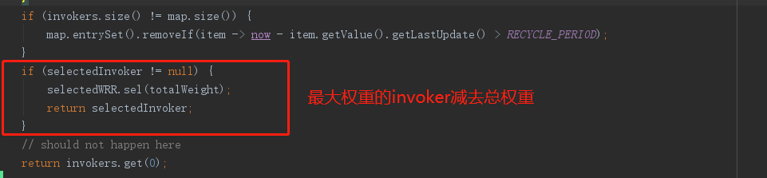

# dubbo的负载均衡策略
## loadbalance简介

LoadBalance 的职责是将网络请求，或者其他形式的负载“均摊”到不同的机器上。避免集群中部分服务器压力过大，而另一些服务器比较空闲的情况。通过负载均衡，可以让每台服务器获取到适合自己处理能力的负载。在为高负载服务器分流的同时，还可以避免资源浪费，一举两得。

## loadbalance调用流程
```java
   org.apache.dubbo.rpc.cluster.support.AbstractClusterInvoker.invoke()
       |_org.apache.dubbo.rpc.cluster.support.AbstractClusterInvoker.list()
       |_org.apache.dubbo.rpc.cluster.support.AbstractClusterInvoker.initLoadBalance()
          |_org.apache.dubbo.rpc.cluster.support.FailoverClusterInvoker.doInvoke()
             |_org.apache.dubbo.rpc.cluster.support.AbstractClusterInvoker.select()
                |_org.apache.dubbo.rpc.cluster.support.AbstractClusterInvoker.doSelect()
                   |_org.apache.dubbo.rpc.cluster.LoadBalance.select()
```
截止dubbo3.0版本，目前共有五种负载均衡策略
```java
random=org.apache.dubbo.rpc.cluster.loadbalance.RandomLoadBalance   加权随机负载均衡
roundrobin=org.apache.dubbo.rpc.cluster.loadbalance.RoundRobinLoadBalance  加权轮询负载均衡
leastactive=org.apache.dubbo.rpc.cluster.loadbalance.LeastActiveLoadBalance   最小活跃数负载均衡 
consistenthash=org.apache.dubbo.rpc.cluster.loadbalance.ConsistentHashLoadBalance   一致性哈希负载均衡
shortestresponse=org.apache.dubbo.rpc.cluster.loadbalance.ShortestResponseLoadBalance   最短响应时间负载均衡
```

### RandomLoadBalance
* 简介：

RandomLoadBalance 是加权随机算法的具体实现，它的算法思想很简单。假设我们有一组服务器 servers = [A, B, C]，他们对应的权重为 weights = [5, 3, 2]，权重总和为10。现在把这些权重值平铺在一维坐标值上，[0, 5) 区间属于服务器 A，[5, 8) 区间属于服务器 B，[8, 10) 区间属于服务器 C。接下来通过随机数生成器生成一个范围在 [0, 10) 之间的随机数，然后计算这个随机数会落到哪个区间上


* demo：以org.apache.dubbo.demo包下的示例为参考
```java
public interface DemoService {

    String sayHello(String name);
    
}
```
```java
public class DemoServiceImpl implements DemoService {
    private static final Logger logger = LoggerFactory.getLogger(DemoServiceImpl.class);

    @Override
    public String sayHello(String name) {
        logger.info("Hello " + name + ", request from consumer: " + RpcContext.getServiceContext().getRemoteAddress());
        return "Hello " + name + ", response from provider: " + RpcContext.getServiceContext().getLocalAddress();
    }
    
}
```
启动两个provider 
provider1：
```java
public class Provider {

    public static void main(String[] args) throws Exception {
        ServiceConfig<DemoServiceImpl> service = new ServiceConfig<>();
        service.setInterface(DemoService.class);
        service.setRef(new DemoServiceImpl());
        setLoadBalance(service, "random", 200);

        ProtocolConfig protocolConfig = setProtocolConfig(111);

        DubboBootstrap bootstrap = DubboBootstrap.getInstance();
        bootstrap.application(new ApplicationConfig("dubbo-demo-api-provider"))
                .registry(new RegistryConfig("zookeeper://127.0.0.1:2181"))
                .service(service)
                .protocol(protocolConfig)
                .start()
                .await();

        System.out.println("Server success");
    }

    private static ProtocolConfig setProtocolConfig(int port) {
        ProtocolConfig protocolConfig = new ProtocolConfig();
        protocolConfig.setPort(port);
        return protocolConfig;
    }

    private static void setLoadBalance(ServiceConfig serviceConfig, String strategy, Integer weight) {
        serviceConfig.setLoadbalance(strategy);
        serviceConfig.setWeight(weight);
    }
}
```
provider2：
```java
public class Provider {

    public static void main(String[] args) throws Exception {
        ServiceConfig<DemoServiceImpl> service = new ServiceConfig<>();
        service.setInterface(DemoService.class);
        service.setRef(new DemoServiceImpl());
        setLoadBalance(service, "random", 400);

        ProtocolConfig protocolConfig = setProtocolConfig(222);

        DubboBootstrap bootstrap = DubboBootstrap.getInstance();
        bootstrap.application(new ApplicationConfig("dubbo-demo-api-provider"))
                .registry(new RegistryConfig("zookeeper://127.0.0.1:2181"))
                .service(service)
                .protocol(protocolConfig)
                .start()
                .await();

        System.out.println("Server success");
    }

    private static ProtocolConfig setProtocolConfig(int port) {
        ProtocolConfig protocolConfig = new ProtocolConfig();
        protocolConfig.setPort(port);
        return protocolConfig;
    }

    private static void setLoadBalance(ServiceConfig serviceConfig, String strategy, Integer weight) {
        serviceConfig.setLoadbalance(strategy);
        serviceConfig.setWeight(weight);
    }
}
```
consumer
```java
public class Consumer {
    public static void main(String[] args) throws IOException {
        ReferenceConfig<DemoService> reference = new ReferenceConfig<>();
        reference.setInterface(DemoService.class);
        reference.setGeneric("true");

        DubboBootstrap bootstrap = DubboBootstrap.getInstance();
        bootstrap.application(new ApplicationConfig("dubbo-demo-api-consumer"))
                .registry(new RegistryConfig("zookeeper://127.0.0.1:2181"))
                .reference(reference)
                .start();

        DemoService demoService = ReferenceConfigCache.getCache().get(reference);

        BufferedReader br = new BufferedReader(new InputStreamReader(System.in));

        while (true) {
            String consoleContent = br.readLine();
            if ("quit".equalsIgnoreCase(consoleContent)) {
                break;
            }

            String message = demoService.sayHello(consoleContent);
            System.out.println(message);
        }
    }
}
```
result:
```java
Hello 1, response from provider: 10.32.114.45:222
1
Hello 1, response from provider: 10.32.114.45:111
1
Hello 1, response from provider: 10.32.114.45:222
1
Hello 1, response from provider: 10.32.114.45:111
1
Hello 1, response from provider: 10.32.114.45:222
1
Hello 1, response from provider: 10.32.114.45:111
1
Hello 1, response from provider: 10.32.114.45:222
1
Hello 1, response from provider: 10.32.114.45:222
1
Hello 1, response from provider: 10.32.114.45:111
1
Hello 1, response from provider: 10.32.114.45:222
11
Hello 11, response from provider: 10.32.114.45:222
1
Hello 1, response from provider: 10.32.114.45:222
```

* 源码分析：


### RoundRobinLoadBalance
* 简介： 
经过加权后，每台服务器能够得到的请求数比例，接近或等于他们的权重比。比如服务器 A、B、C 权重比为 5:2:1。那么在8次请求中，服务器 A 将收到其中的5次请求，服务器 B 会收到其中的2次请求，服务器 C 则收到其中的1次请求。

* demo（修改Provider类中main方法）： 
provider1：
```java
setLoadBalance(service, "roundrobin", 200);
ProtocolConfig protocolConfig = setProtocolConfig(111);
```
provider2:
```java
setLoadBalance(service, "roundrobin", 200);
ProtocolConfig protocolConfig = setProtocolConfig(222);
```
provider3:
```java
setLoadBalance(service, "roundrobin", 400);
ProtocolConfig protocolConfig = setProtocolConfig(333);
```
result：
```java
1
Hello 1, response from provider: 10.32.114.45:333
1
Hello 1, response from provider: 10.32.114.45:222
1
Hello 1, response from provider: 10.32.114.45:111
1
Hello 1, response from provider: 10.32.114.45:333
1
Hello 1, response from provider: 10.32.114.45:333
1
Hello 1, response from provider: 10.32.114.45:222
1
Hello 1, response from provider: 10.32.114.45:111
1
Hello 1, response from provider: 10.32.114.45:333
```
* 源码分析：



逻辑梳理示意:


### LeastActiveLoadBalance

* 简介：
活跃调用数越小，表明该服务提供者效率越高，单位时间内可处理更多的请求。在具体实现中，每个服务提供者对应一个活跃数 active。初始情况下，所有服务提供者活跃数均为0。每收到一个请求，活跃数加1，完成请求后则将活跃数减1，性能好的服务提供者处理请求的速度更快，因此活跃数下降的也越快，此时这样的服务提供者能够优先获取到新的服务请求。活跃数相同的情况下，采用加权随机算法。
* demo（修改Provider类中main方法）：
provider1:
```java
  setLoadBalance(service, "leastactive", 200);
  ProtocolConfig protocolConfig = setProtocolConfig(36454);
```
provider2:
```java
  setLoadBalance(service, "leastactive", 400);
  ProtocolConfig protocolConfig = setProtocolConfig(39515);
```
consumer添加如下代码：
```java
 reference.setActives(1000);
 reference.setCheck(false);
```
result:
```java
1
Hello 1, response from provider: 10.32.114.45:39515
1
Hello 1, response from provider: 10.32.114.45:36454
1
Hello 1, response from provider: 10.32.114.45:39515
1
Hello 1, response from provider: 10.32.114.45:39515
1
Hello 1, response from provider: 10.32.114.45:39515
1
Hello 1, response from provider: 10.32.114.45:36454
```
* 源码分析：


### ShortestResponseLoadBalance
* 简介：
与LeastActiveLoadBalance相似。不同的是，统计的数据不是活跃数active，而是最短响应时间 succeededAverageElapsed（成功请求的平均响应耗时） * active。
* demo：

provider1：
```java
  setLoadBalance(service, "shortestresponse", 200);
  ProtocolConfig protocolConfig = setProtocolConfig(37885);
```
provider2：
```java
  setLoadBalance(service, "shortestresponse", 400);
  ProtocolConfig protocolConfig = setProtocolConfig(36418);
```
consumer添加如下代码：
```java
 reference.setActives(1000);
 reference.setCheck(false);
```
result：
```java
1
Hello 1, response from provider: 10.32.114.45:36418
1
Hello 1, response from provider: 10.32.114.45:36418
1
Hello 1, response from provider: 10.32.114.45:36418
1
Hello 1, response from provider: 10.32.114.45:37885
1
Hello 1, response from provider: 10.32.114.45:36418
1
Hello 1, response from provider: 10.32.114.45:37885
```

* 源码分析：


### ConsistentHashLoadBalance
* 简介：
一致性 hash 算法工作过程是，首先根据 ip 或者其他的信息为缓存节点生成一个 hash，并将这个 hash 投射到 [0, 2^32 - 1] 的圆环上。当有查询或写入请求时，则为缓存项的 key 生成一个 hash 值。然后查找第一个大于或等于该 hash 值的缓存节点，并到这个节点中查询或写入缓存项。


出现的问题：数据倾斜
改进：采用虚拟节点


* 源码分析：
* demo：
provider1：
```java
  setLoadBalance(service, "consistenthash", 200);
  ProtocolConfig protocolConfig = setProtocolConfig(111);
```
provider2:
```java
  setLoadBalance(service, "consistenthash", 200);
  ProtocolConfig protocolConfig = setProtocolConfig(222);
```
result：
```java
1
Hello 1, response from provider: 10.32.114.45:111
1
Hello 1, response from provider: 10.32.114.45:111
1
Hello 1, response from provider: 10.32.114.45:111
1
Hello 1, response from provider: 10.32.114.45:111
2
Hello 2, response from provider: 10.32.114.45:222
2
Hello 2, response from provider: 10.32.114.45:222
2
Hello 2, response from provider: 10.32.114.45:222
2
Hello 2, response from provider: 10.32.114.45:222
```
* 源码分析：


### 总结
**加权随机负载均衡**： 根据权重随机选取provider，权重越高，provider被选中的概率越大。

**加权轮询负载均衡**：轮询选取provider，且基于权重分配provider被选中的次数。如A、B、C三个provider，权重为1、1、2，那么一共四次的选取中，A、B、C被选中的次数分别为1、1、2次。

**最小活跃数负载均衡**：  选取最小活跃数的provider。若各provider的活跃数相同，则根据权重随机选择provider。

**最短响应时间负载均衡**： 选取最短响应时间的provider。若各provider的最短响应时间相同，则根据权重随机选择provider。

**一致性哈希负载均衡**：  在一致性哈希算法中，引入了虚拟节点的概念，在hash环上设置均匀分散的虚拟节点指向provider。实现相同参数的请求指向同一个provider。


### 参考文档：
https://dubbo.apache.org/zh/docs/v2.7/dev/source/loadbalance/#m-zhdocsv27devsourceloadbalance
https://blog.csdn.net/qq_27243343/article/details/106459095


