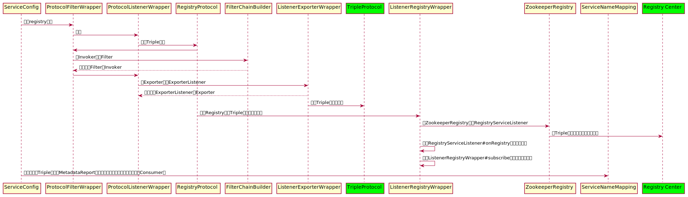

# 深入解析Dubbo3.0服务端暴露全流程
## 背景
随着云原生时代的到来，Dubbo3.0的一个很重要的目标就是全面拥抱云原生。正因如此，Dubbo3.0为了能够更好的适配云原生，将原来的接口级服务发现机制演进为应用级服务发现机制。
基于应用级服务发现机制，Dubbo3.0能大幅降低框架带来的额外资源消耗，大幅提升资源利用率，主要体现在：

* 单机常驻内存下降 75%
* 能支持的集群实例规模以百万计的集群
* 注册中心总体数据量下降超 90%

目前关于Dubbo服务端暴露流程的技术文章很多，但是都是基于Dubbo接口级服务发现机制来解读的。在Dubbo3.0的应用级服务发现机制下，服务端暴露流程与之前有很大的变化，本文希望可以通过对Dubbo3.0源码理解来解析服务端暴露全流程。

## 什么是应用级服务发现
简单来说，以前Dubbo是将接口的信息全部注册到注册中心，而一个应用实例一般会存在多个接口，这样一来注册的数据量就要大很多，而且有冗余。应用级服务发现的机制是同一个应用实例仅在注册中心注册一条数据，这种机制主要解决以下几个问题：
* 对齐主流微服务模型，如：Spring Cloud
* 支持Kubernetes native service，Kubernetes中维护调度的服务都是基于应用实例级，不支持接口级
* 减少注册中心数据存储能力，降低了地址变更推送的压力

假设应用dubbo-application部署了3个实例（instance1, instance2, instance3），并且对外提供了3个接口（sayHello, echo, getVersion）分别设置了不同的超时时间。在接口级和应用级服务发现机制下，注册到注册中心的数据是截然不同的。如下图所示：

* 接口级服务发现机制下注册中心中的数据
```java
"sayHello": [
  {"application":"dubbo-application","name":"instance1", "ip":"127.0.0.1", "metadata":{"timeout":1000}},
  {"application":"dubbo-application","name":"instance2", "ip":"127.0.0.2", "metadata":{"timeout":2000}},
  {"application":"dubbo-application","name":"instance3", "ip":"127.0.0.3", "metadata":{"timeout":3000}},
],
"echo": [
  {"application":"dubbo-application","name":"instance1", "ip":"127.0.0.1", "metadata":{"timeout":1000}},
  {"application":"dubbo-application","name":"instance2", "ip":"127.0.0.2", "metadata":{"timeout":2000}},
  {"application":"dubbo-application","name":"instance3", "ip":"127.0.0.3", "metadata":{"timeout":3000}},
],
"getVersion": [
  {"application":"dubbo-application","name":"instance1", "ip":"127.0.0.1", "metadata":{"timeout":1000}},
  {"application":"dubbo-application","name":"instance2", "ip":"127.0.0.2", "metadata":{"timeout":2000}},
  {"application":"dubbo-application","name":"instance3", "ip":"127.0.0.3", "metadata":{"timeout":3000}}
]
```

* 应用级服务发现机制下注册中心中的数据
```java
"dubbo-application": [
  {"name":"instance1", "ip":"127.0.0.1", "metadata":{"timeout":1000}},
  {"name":"instance2", "ip":"127.0.0.2", "metadata":{"timeout":2000}},
  {"name":"instance3", "ip":"127.0.0.3", "metadata":{"timeout":3000}}
]
```

通过对比我们可以发现，采用应用级服务发现机制确实使注册中心中的数据量减少了很多，那些原有的接口级的数据存储在元数据中心中。


## 服务端暴露全流程
引入应用级服务发现机制以后，Dubbo服务端暴露全流程和之前有很大的区别。暴露服务端全流程的核心代码在DubboBootstrap#doStart中，具体如下：
```java
private void doStart() {
    // 1. 暴露Dubbo服务
    exportServices();
    // If register consumer instance or has exported services
    if (isRegisterConsumerInstance() || hasExportedServices()) {
        // 2. 暴露元数据服务
        exportMetadataService();
        // 3. 定时更新和上报元数据
        registerServiceInstance();
        ....
    }
    ......
}
```
假设用Zookeeper作为注册中，对外暴露Triple协议的服务为例，服务端暴露全流程时序图如下：


我们可以看到，整个的暴露流程还是挺复杂的，一共可以分为四个部分：
* 暴露injvm协议的服务
* 注册service-discovery-registry协议
* 暴露Triple协议的服务并注册registry协议
* 暴露MetadataService服务

下面会分别从这四个部分对服务暴露流程进行详细讲解。

### 暴露injvm协议的服务
injvm协议的服务是暴露在本地的，主要原因是在一个应用上往往既有Service（暴露服务）又有Reference（服务引用）的情况存在，并且Reference引用的服务就是在该应用上暴露的Service。为了支持这种使用场景，Dubbo提供了injvm协议，将Service暴露在本地，Reference就可以不需要走网络直接在本地调用Service。

#### 整体时序图


#### 核心代码
* 暴露injvm协议的服务入口
核心代码在ServiceConfig#exportLocal中，具体如下：
```java
private void exportLocal(URL url) {
    // 协议变更
    URL local = URLBuilder.from(url)
            .setProtocol(LOCAL_PROTOCOL)
            .setHost(LOCALHOST_VALUE)
            .setPort(0)
            .build();
    // 暴露injvm协议
    doExportUrl(local, false);
    logger.info("Export dubbo service " + interfaceClass.getName() + " to local registry url : " + local);
}
```

* 创建Invoker
核心代码在ServiceConfig#doExportUrl中，具体如下：
```java
private void doExportUrl(URL url, boolean withMetaData) {
    // 通过SPI动态创建Invoker
    Invoker<?> invoker = PROXY_FACTORY.getInvoker(ref, (Class) interfaceClass, url);
    // 如果是暴露Metadata对Invoker进行包装
    if (withMetaData) {
        invoker = new DelegateProviderMetaDataInvoker(invoker, this);
    }
    // 通过协议将Invoker进行包装成Exporter
    // PROTOCOL为Triple协议的代理类
    Exporter<?> exporter = PROTOCOL.export(invoker);
    exporters.add(exporter);
}
```

* 在Invoker中添加Filter
核心代码在DefaultFilterChainBuilder#buildInvokerChain中，具体如下：
```java
public <T> Invoker<T> buildInvokerChain(final Invoker<T> originalInvoker, String key, String group) {
    Invoker<T> last = originalInvoker;
    List<Filter> filters = ExtensionLoader.getExtensionLoader(Filter.class).getActivateExtension(originalInvoker.getUrl(), key, group);

    // 为invoker添加8个Filter
    // 1. TracerFilter
    // 2. TimeoutFilter
    // 3. MonitorFilter
    // 4. ExceptionFilter
    // 5. ContextFilter
    // 6. GenericFilter
    // 7. ClassLoaderFilter
    // 8. EchoFilter
    if (!filters.isEmpty()) {
        for (int i = filters.size() - 1; i >= 0; i--) {
            final Filter filter = filters.get(i);
            final Invoker<T> next = last;
            last = new FilterChainNode<>(originalInvoker, next, filter);
        }
    }
    return last;
}
```

* 将Invoker转化为Exporter
核心代码在ProtocolListenerWrapper#export中，具体如下：
```java
public <T> Exporter<T> export(Invoker<T> invoker) throws RpcException {
    // 如果是registry或者service-discovery-registry协议就直接通过协议将Invoker转化成Exporter
    if (UrlUtils.isRegistry(invoker.getUrl())) {
        return protocol.export(invoker);
    }
    // 1. 将invoker通过协议转化成Exporter
    // 2. 在Exporter中组合ExporterListener
    return new ListenerExporterWrapper<T>(protocol.export(invoker),
            Collections.unmodifiableList(ExtensionLoader.getExtensionLoader(ExporterListener.class)
                    .getActivateExtension(invoker.getUrl(), EXPORTER_LISTENER_KEY)));
}
```

* 在Exporter中组合ExporterListener
在ExporterListener中定义了exported和unexported事件，用来维护整个Exporter的生命周期，核心代码在ListenerExporterWrapper的构造函数和ListenerExporterWrapper#unexport中，具体如下：

**ListenerExporterWrapper构造函数**
```java
public ListenerExporterWrapper(Exporter<T> exporter, List<ExporterListener> listeners) {
    ......
    this.exporter = exporter;
    this.listeners = listeners;
    if (CollectionUtils.isNotEmpty(listeners)) {
        RuntimeException exception = null;
        for (ExporterListener listener : listeners) {
            if (listener != null) {
                try {
                    // 暴露Exporter后
                    listener.exported(this);
                } catch (RuntimeException t) {
                    logger.error(t.getMessage(), t);
                    exception = t;
                }
            }
        }
        ......
    }
}
```
**ListenerExporterWrapper#unexport**
```java
public void unexport() {
    try {
        exporter.unexport();
    } finally {
        if (CollectionUtils.isNotEmpty(listeners)) {
            RuntimeException exception = null;
            for (ExporterListener listener : listeners) {
                if (listener != null) {
                    try {
                        // 取消暴露Exporter后
                        listener.unexported(this);
                    } catch (RuntimeException t) {
                        logger.error(t.getMessage(), t);
                        exception = t;
                    }
                }
            }
            if (exception != null) {
                throw exception;
            }
        }
    }
}
```

* 暴露Triple协议的服务
核心代码在TripleProtocol#export中，具体如下：
```java
public <T> Exporter<T> export(Invoker<T> invoker) throws RpcException {
    URL url = invoker.getUrl();
    String key = serviceKey(url);
    final AbstractExporter<T> exporter = new AbstractExporter<T>(invoker) {
        @Override
        public void afterUnExport() {
            pathResolver.remove(url.getServiceKey());
            pathResolver.remove(url.getServiceInterface());
            exporterMap.remove(key);
        }
    };

    exporterMap.put(key, exporter);
    invokers.add(invoker);
    pathResolver.add(url.getServiceKey(), invoker);
    pathResolver.add(url.getServiceInterface(), invoker);
    PortUnificationExchanger.bind(invoker.getUrl());
    return exporter;
}
```
由于Triple协议的实现流程相对来说比较复杂，暂时不在这里展开讨论，以后会对其进行详细讲解。

#### 注册service-discovery-registry协议
注册service-discovery-registry协议的核心目的是为了注册与服务相关的元数据，默认情况下元数据通过InMemoryWritableMetadataService将数据存储在本地内存和本地文件。

##### 整体时序图


##### 核心代码
核心代码在ServiceConfig#exportRemote中，具体如下：
* 注册service-discovery-registry协议的入口
```java
private URL exportRemote(URL url, List<URL> registryURLs) {
    if (CollectionUtils.isNotEmpty(registryURLs)) {
        // 如果是多个注册中心，通过循环对每个注册中心进行注册
        for (URL registryURL : registryURLs) {
            // 判断是否是service-discovery-registry协议
            // 将service-name-mapping参数的值设置为true
            if (SERVICE_REGISTRY_PROTOCOL.equals(registryURL.getProtocol())) {
                url = url.addParameterIfAbsent(SERVICE_NAME_MAPPING_KEY, "true");
            }
            ......
            // 注册service-discovery-registry协议复用服务暴露流程
            doExportUrl(registryURL.putAttribute(EXPORT_KEY, url), true);
        }
    ......
    return url;
}
```

* invoker中包装Metadata
核心代码在ServiceConfig#doExportUrl中，具体如下：
```java
private void doExportUrl(URL url, boolean withMetaData) {
    Invoker<?> invoker = PROXY_FACTORY.getInvoker(ref, (Class) interfaceClass, url);
    // 此时的withMetaData的值为true
    // 将invoker包装成DelegateProviderMetaDataInvoker
    if (withMetaData) {
        invoker = new DelegateProviderMetaDataInvoker(invoker, this);
    }
    Exporter<?> exporter = PROTOCOL.export(invoker);
    exporters.add(exporter);
}


public class DelegateProviderMetaDataInvoker<T> implements Invoker {
    protected final Invoker<T> invoker;
    private ServiceConfig<?> metadata;
    // 在Invoker中组合了metadata
    public DelegateProviderMetaDataInvoker(Invoker<T> invoker, ServiceConfig<?> metadata) {
        this.invoker = invoker;
        this.metadata = metadata;
    }
    ......

    @Override
    public Result invoke(Invocation invocation) throws RpcException {
        return invoker.invoke(invocation);
    }

    public ServiceConfig<?> getMetadata() {
        return metadata;
    }
}
```

* 通过RegistryProtocol将Invoker转化成Exporter
核心代码在ProtocolListenerWrapper#export中，具体如下：
```java
public <T> Exporter<T> export(Invoker<T> invoker) throws RpcException {
    // 此时的protocol为RegistryProtocol类型
    if (UrlUtils.isRegistry(invoker.getUrl())) {
        return protocol.export(invoker);
    }
    ......
}
```

* RegistryProtocol将Invoker转化成Exporter的核心流程
核心代码在RegistryProtocol#export中，具体如下：
```java
public <T> Exporter<T> export(final Invoker<T> originInvoker) throws RpcException {
    URL registryUrl = getRegistryUrl(originInvoker);
    URL providerUrl = getProviderUrl(originInvoker);
    ......
    // 再次暴露Triple协议的服务
    final ExporterChangeableWrapper<T> exporter = doLocalExport(originInvoker, providerUrl);

    // registryUrl中包含service-discovery-registry协议
    // 通过该协议创建ServiceDiscoveryRegistry对象
    // 然后组合RegistryServiceListener监听器，
    // 最后包装成ListenerRegistryWrapper对象
    final Registry registry = getRegistry(registryUrl);
    final URL registeredProviderUrl = getUrlToRegistry(providerUrl, registryUrl);

    boolean register = providerUrl.getParameter(REGISTER_KEY, true);
    if (register) {
        // 注册service-discovery-registry协议
        // 触发RegistryServiceListener的onRegister事件
        register(registry, registeredProviderUrl);
    }
    ......
    // 触发RegistryServiceListener的onRegister事件
    notifyExport(exporter);
    return new DestroyableExporter<>(exporter);
}
```

* 再次暴露Triple协议的服务
核心代码在RegistryProtocol#doLocalExport中，具体如下：
```java
private <T> ExporterChangeableWrapper<T> doLocalExport(final Invoker<T> originInvoker, URL providerUrl) {
    String key = getCacheKey(originInvoker);
    // 此时的protocol为Triple协议的代理类
    // 和上面讲到的暴露injvm协议的PROTOCOL相同
    return (ExporterChangeableWrapper<T>) bounds.computeIfAbsent(key, s -> {
        Invoker<?> invokerDelegate = new InvokerDelegate<>(originInvoker, providerUrl);
        return new ExporterChangeableWrapper<>((Exporter<T>) protocol.export(invokerDelegate), originInvoker);
    });
}
```

* 创建ListenerRegistryWrapper对象
核心代码在RegistryFactoryWrapper#getRegistry中，具体如下：
```java
public Registry getRegistry(URL url) {
    return new ListenerRegistryWrapper(registryFactory.getRegistry(url),
            Collections.unmodifiableList(ExtensionLoader.getExtensionLoader(RegistryServiceListener.class)
                    .getActivateExtension(url, "registry.listeners")));
}
```

* 注册service-discovery-registry协议
核心代码在ServiceDiscoveryRegistry#register和ServiceDiscoveryRegistry#doRegister中，具体如下：

**ServiceDiscoveryRegistry#register**
```java
public final void register(URL url) {
    // 只有服务端（Provider）才需要注册
    if (!shouldRegister(url)) {
        return;
    }
    // 注册service-discovery-registry协议
    doRegister(url);
}
```

**ServiceDiscoveryRegistry#doRegister**
```java
public void doRegister(URL url) {
    url = addRegistryClusterKey(url);
    // 注册元数据
    if (writableMetadataService.exportURL(url)) {
        if (logger.isInfoEnabled()) {
            logger.info(format("The URL[%s] registered successfully.", url.toString()));
        }
    } else {
        if (logger.isWarnEnabled()) {
            logger.warn(format("The URL[%s] has been registered.", url.toString()));
        }
    }
}
```

**注册元数据**
核心代码在InMemoryWritableMetadataService#exportURL中，具体如下：
```java
public boolean exportURL(URL url) {
    // 如果是MetadataService，则不注册元数据
    if (MetadataService.class.getName().equals(url.getServiceInterface())) {
        this.metadataServiceURL = url;
        return true;
    }

    updateLock.readLock().lock();
    try {
        String[] clusters = getRegistryCluster(url).split(",");
        for (String cluster : clusters) {
            MetadataInfo metadataInfo = metadataInfos.computeIfAbsent(cluster, k -> new MetadataInfo(ApplicationModel.getName()));
            // 将Triple协议的服务中接口相关的数据生成ServiceInfo
            // 将ServiceInfo注册到MetadataInfo中
            metadataInfo.addService(new ServiceInfo(url));
        }
        metadataSemaphore.release();
        return addURL(exportedServiceURLs, url);
    } finally {
        updateLock.readLock().unlock();
    }
}
```

**发布onRegister事件** 
核心代码在ListenerRegistryWrapper#register中，具体如下：
```java
public void register(URL url) {
    try {
        // registry为ServiceDiscoveryRegistry对象
        // 此时已经调用完ServiceDiscoveryRegistry#registry方法
        registry.register(url);
    } finally {
        if (CollectionUtils.isNotEmpty(listeners) && !UrlUtils.isConsumer(url)) {
            RuntimeException exception = null;
            for (RegistryServiceListener listener : listeners) {
                if (listener != null) {
                    try {
                        // 注册完service-discovery-registry协议后发布onRegister事件
                        listener.onRegister(url, registry);
                    } catch (RuntimeException t) {
                        logger.error(t.getMessage(), t);
                        exception = t;
                    }
                }
            }
            if (exception != null) {
                throw exception;
            }
        }
    }
}
```

**发布服务注册事件**
核心代码在RegistryProtocol#notifyExport中，具体如下：
```java
private <T> void notifyExport(ExporterChangeableWrapper<T> exporter) {
    List<RegistryProtocolListener> listeners = ExtensionLoader.getExtensionLoader(RegistryProtocolListener.class)
        .getActivateExtension(exporter.getOriginInvoker().getUrl(), "registry.protocol.listener");
    if (CollectionUtils.isNotEmpty(listeners)) {
        for (RegistryProtocolListener listener : listeners) {
            // 发布RegistryProtocolListener的onExport事件
            listener.onExport(this, exporter);
        }
    }
}
```
我们可以看出注册service-discovery-registry协议的核心目的是为了将服务的接口相关的信息存储在内存中。从兼容性和平滑迁移两方面来考虑，社区在实现的时候采取复用ServiceConfig的暴露流程的方式。

##### 暴露Triple协议服务并注册registry协议
暴露Triple协议的服务并注册registry协议是Dubbo服务暴露的核心流程，一共分为两部分：
* 暴露Triple协议的服务
* 注册registry协议

由于暴露Triple协议服务的流程和暴露Injvm协议服务的流程是一致的，所以不再赘述。注册registry协议的过程仅仅注册了应用实例相关的信息，也就是之前提到的应用级服务发现机制。

**整体时序图**


**核心代码**
* 通过InterfaceCompatibleRegistryProtocol将Invoker转化成Exporter

核心代码在ProtocolListenerWrapper#export中，具体如下：
```java
public <T> Exporter<T> export(Invoker<T> invoker) throws RpcException {
    // 此时的protocol为InterfaceCompatibleRegistryProtocol类型（继承了RegistryProtocol）
    // 注意：在注册service-discovery-registry协议的时候protocol为RegistryProtocol类型
    if (UrlUtils.isRegistry(invoker.getUrl())) {
        return protocol.export(invoker);
    }
    ......
}
```

* RegistryProtocol将Invoker转化成Exporter的核心流程

核心代码在RegistryProtocol#export中，具体如下：
```java
public <T> Exporter<T> export(final Invoker<T> originInvoker) throws RpcException {
    URL registryUrl = getRegistryUrl(originInvoker);
    URL providerUrl = getProviderUrl(originInvoker);
    ......
    // 再次暴露Triple协议的服务
    final ExporterChangeableWrapper<T> exporter = doLocalExport(originInvoker, providerUrl);

    // registryUrl中包含registry协议
    // 通过该协议创建ZookeeperRegistry对象
    // 然后组合RegistryServiceListener监听器，
    // 最后包装成ListenerRegistryWrapper对象
    // 注意：
    // 1. service-discovery-registry协议对应的是ServiceDiscoveryRegistry
    // 2. registry协议对应的是ZookeeperRegistry
    final Registry registry = getRegistry(registryUrl);
    final URL registeredProviderUrl = getUrlToRegistry(providerUrl, registryUrl);

    boolean register = providerUrl.getParameter(REGISTER_KEY, true);
    if (register) {
        // 注册registry协议
        // 触发RegistryServiceListener的onRegister事件
        register(registry, registeredProviderUrl);
    }
    ......
    // 发布RegistryProtocolListener的onExport事件
    notifyExport(exporter);
    return new DestroyableExporter<>(exporter);
}
```

* 注册registry协议

核心代码在FailbackRegistry#register和ServiceDiscoveryRegistry#doRegister中（ZookeeperRegistry继承FailbackRegistry）中，具体如下：

**FailbackRegistry#register**
```java
public void register(URL url) {
    if (!acceptable(url)) {
        ......
        try {
            // 注册registry协议
            doRegister(url);
        } catch (Exception e) {
            ......
        }
    }
}
```

**ZookeeperRegistry#doRegister**
```java
public void doRegister(URL url) {
    try {
        // 在zookeeper上注册Provider
        // 目录：/dubbo/xxxService/providers/***
        // 数据：dubbo://192.168.31.167:20800/xxxService?anyhost=true&
        //      application=application-name&async=false&deprecated=false&dubbo=2.0.2&
        //      dynamic=true&file.cache=false&generic=false&interface=xxxService&
        //      metadata-type=remote&methods=hello&pid=82470&release=&
        //      service-name-mapping=true&side=provider&timestamp=1629588251493
        zkClient.create(toUrlPath(url), url.getParameter(DYNAMIC_KEY, true));
    } catch (Throwable e) {
        throw new RpcException("Failed to register " + url + " to zookeeper " + getUrl() + ", cause: " + e.getMessage(), e);
    }
}
```

* 订阅地址变更

核心代码在FailbackRegistry#subscribe和ZookeeperRegistry#doSubscribe中，具体如下：
**FailbackRegistry#subscribe**
```java
public void subscribe(URL url, NotifyListener listener) {
    ......
    try {
        // 调用ZookeeperRegistry#doSubscribe
        doSubscribe(url, listener);
    } catch (Exception e) {
    ......
}
```

**ZookeeperRegistry#doSubscribe**
```java
public void doSubscribe(final URL url, final NotifyListener listener) {
    try {
        if (ANY_VALUE.equals(url.getServiceInterface())) {
            ......
        } else {
            ......
            for (String path : toCategoriesPath(url)) {
                ConcurrentMap<NotifyListener, ChildListener> listeners = zkListeners.computeIfAbsent(url, k -> new ConcurrentHashMap<>());
                ChildListener zkListener = listeners.computeIfAbsent(listener, k -> new RegistryChildListenerImpl(url, path, k, latch));
                if (zkListener instanceof RegistryChildListenerImpl) {
                    ((RegistryChildListenerImpl) zkListener).setLatch(latch);
                }
                // 创建临时节点用来存储configurators数据
                // 目录：/dubbo/xxxService/configurators
                // 数据：应用的配置信息，可以在dubbo-admin中进行修改，默认为空
                zkClient.create(path, false);
                // 添加监听器，用来监听configurators中的变化
                List<String> children = zkClient.addChildListener(path, zkListener);
                if (children != null) {
                    urls.addAll(toUrlsWithEmpty(url, path, children));
                }
            }
            ......
        }
    } catch (Throwable e) {
        ......
    }
}
```

* 建立暴露的Triple协议服务与Metadata之间的联系

核心代码在ServiceConfig#exportUrl、MetadataUtils#publishServiceDefinition、InMemoryWritableMetadataService#publishServiceDefinition、RemoteMetadataServiceImpl#publishServiceDefinition和MetadataReport#storeProviderMetadata中，具体如下：

**ServiceConfig#exportUrl**
```java
private void exportUrl(URL url, List<URL> registryURLs) {
    ......
    if (!SCOPE_NONE.equalsIgnoreCase(scope)) {
        ......
        if (!SCOPE_LOCAL.equalsIgnoreCase(scope)) {
            url = exportRemote(url, registryURLs);
            // 发布事件，更新服务接口相关的数据
            MetadataUtils.publishServiceDefinition(url);
        }
    }
    ......
}
```

**MetadataUtils#publishServiceDefinition**
```java
public static void publishServiceDefinition(URL url) {
    // 将服务接口相关的数据存在到InMemoryWritableMetadataService中
    WritableMetadataService.getDefaultExtension().publishServiceDefinition(url);
    // 将服务接口相关的数据存在到远端的元数据中心
    if (REMOTE_METADATA_STORAGE_TYPE.equalsIgnoreCase(url.getParameter(METADATA_KEY))) {
        getRemoteMetadataService().publishServiceDefinition(url);
    }
}
```

**InMemoryWritableMetadataService#publishServiceDefinition**
```java
public void publishServiceDefinition(URL url) {
    try {
        String interfaceName = url.getServiceInterface();
        if (StringUtils.isNotEmpty(interfaceName)
            && !ProtocolUtils.isGeneric(url.getParameter(GENERIC_KEY))) {
            Class interfaceClass = Class.forName(interfaceName);
            ServiceDefinition serviceDefinition = ServiceDefinitionBuilder.build(interfaceClass);
            Gson gson = new Gson();
            String data = gson.toJson(serviceDefinition);
            // 存储服务接口相关数据
            // 数据格式：
            // {
            //   "canonicalName": "xxxService",
            //   "codeSource": "file:/Users/xxxx",
            //   "methods": [{
            //       "name": "hello",
            //       "parameterTypes": ["java.lang.String"],
            //       "returnType": "java.lang.String",
            //       "annotations": []
            //   }],
            //   "types": [{
            //       "type": "java.lang.String"
            //    }],
            //  "annotations": []
            // } 
            serviceDefinitions.put(url.getServiceKey(), data);
            return;
        } else if (CONSUMER_SIDE.equalsIgnoreCase(url.getParameter(SIDE_KEY))) {
            ......
        }
        ......
    } catch (Throwable e) {
        ......
    }
}
```

**RemoteMetadataServiceImpl#publishServiceDefinition**

```java
public void publishServiceDefinition(URL url) {
    checkRemoteConfigured();
    String side = url.getSide();
    if (PROVIDER_SIDE.equalsIgnoreCase(side)) {
        // 发布服务端（Provider）的服务接口信息到元数据中心
        publishProvider(url);
    } else {
        ......
    }
}
```

**RemoteMetadataServiceImpl#publishProvider**

```java
private void publishProvider(URL providerUrl) throws RpcException {
    ......
    try {
        String interfaceName = providerUrl.getServiceInterface();
        if (StringUtils.isNotEmpty(interfaceName)) {
            ......
            for (Map.Entry<String, MetadataReport> entry : getMetadataReports().entrySet()) {
                // 获取MetadataReport服务，该服务用来访问元数据中心
                MetadataReport metadataReport = entry.getValue();
                // 将服务接口信息存储到元数据中心
                metadataReport.storeProviderMetadata(new MetadataIdentifier(providerUrl.getServiceInterface(),
                    providerUrl.getVersion(), providerUrl.getGroup(),
                    PROVIDER_SIDE, providerUrl.getApplication()), fullServiceDefinition);
            }
            return;
        }
        ......
    } catch (ClassNotFoundException e) {
        ......
    }
}
```

**AbstractMetadataReport#storeProviderMetadata**

```java
public void storeProviderMetadata(MetadataIdentifier providerMetadataIdentifier, ServiceDefinition serviceDefinition){
    if (syncReport) {
        storeProviderMetadataTask(providerMetadataIdentifier, serviceDefinition);
    } else {
        // 异步存储到元数据中心
        reportCacheExecutor.execute(() -> storeProviderMetadataTask(providerMetadataIdentifier, serviceDefinition));
    }
}

private void storeProviderMetadataTask(MetadataIdentifier providerMetadataIdentifier, ServiceDefinition serviceDefinition) {
    try {
        ......
        allMetadataReports.put(providerMetadataIdentifier, serviceDefinition);
        failedReports.remove(providerMetadataIdentifier);
        Gson gson = new Gson();
        // data的数据格式：
        // {
        //   "parameters": {
        //       "side": "provider", 
        //       "interface": "xxxService",
        //       "metadata-type": "remote",
        //       "service-name-mapping": "true",
        //   },
        //   "canonicalName": "xxxService",
        //   "codeSource": "file:/Users/xxxx",
        //   "methods": [{
        //       "name": "hello",
        //       "parameterTypes": ["java.lang.String"],
        //       "returnType": "java.lang.String",
        //       "annotations": []
        //   }],
        //   "types": [{
        //       "type": "java.lang.String"
        //    }],
        //  "annotations": []
        // } 
        String data = gson.toJson(serviceDefinition);
        // 存储到元数据中心，实例中的元数据中心是ZookeeperMetadataReport
        // 目录：元数据中心Metadata-report的/dubbo/metadata/xxxService/provider/${application-name}节点下
        doStoreProviderMetadata(providerMetadataIdentifier, data);
        // 存储到本地文件
        // 路径：xxxService:::provider:${application-name} 
        saveProperties(providerMetadataIdentifier, data, true, !syncReport);
    } catch (Exception e) {
        ......
    }
}
```

* 建立Triple协议服务与MetadataReport服务之间的关系

核心代码在ServiceConfig#exported、MetadataServiceNameMapping#map和ZookeeperMetadataReport#registerServiceAppMapping中，具体如下：

**ServiceConfig#exported**

```java
protected void exported() {
    exported = true;
    List<URL> exportedURLs = this.getExportedUrls();
    exportedURLs.forEach(url -> {
        // 判断URL中是否标记有service-name-mapping的字段
        // 标记有该字段的服务是需要将暴露的服务与元数据中心关联起来
        // Consumer可以通过元数据中心的消息变更感知到Provider端元数据的变更
        if (url.getParameters().containsKey(SERVICE_NAME_MAPPING_KEY)) {
            ServiceNameMapping serviceNameMapping = ServiceNameMapping.getDefaultExtension();
            // 建立关系
            serviceNameMapping.map(url);
        }
    });
    onExported();
}
```

**MetadataServiceNameMapping#map**

```java
public void map(URL url) {
    execute(() -> {
        String registryCluster = getRegistryCluster(url);
        // 获取MetadataReport，也就是元数据中心的访问路径
        MetadataReport metadataReport = MetadataReportInstance.getMetadataReport(registryCluster);
        ......
        int currentRetryTimes = 1;
        boolean success;
        String newConfigContent = getName();
        do {
            // 获取元数据中心中存储的应用的版本信息
            ConfigItem configItem = metadataReport.getConfigItem(serviceInterface, DEFAULT_MAPPING_GROUP);
            String oldConfigContent = configItem.getContent();
            if (StringUtils.isNotEmpty(oldConfigContent)) {
                boolean contains = StringUtils.isContains(oldConfigContent, getName());
                if (contains) {
                    break;
                }
                newConfigContent = oldConfigContent + COMMA_SEPARATOR + getName();
            }
            // 在元数据中心创建mapping节点，并将暴露的服务数据存到元数据中心，这里的元数据中心用zookeeper实现的
            // 目录：/dubbo/mapping/xxxService
            // 数据：configItem.content为${application-name}，configItem.ticket为版本好
            success = metadataReport.registerServiceAppMapping(serviceInterface, DEFAULT_MAPPING_GROUP, newConfigContent, configItem.getTicket());
        } while (!success && currentRetryTimes++ <= CAS_RETRY_TIMES);
    });
}
```

**ZookeeperMetadataReport#registerServiceAppMapping**

```java
public boolean registerServiceAppMapping(String key, String group, String content, Object ticket) {
    try {
        if (ticket != null && !(ticket instanceof Stat)) {
            throw new IllegalArgumentException("zookeeper publishConfigCas requires stat type ticket");
        }
        String pathKey = buildPathKey(group, key);
        // 1. 创建/dubbo/mapping/xxxService目录，存储的数据为configItem
        // 2. 生成版本号
        zkClient.createOrUpdate(pathKey, content, false, ticket == null ? 0 : ((Stat) ticket).getVersion());
        return true;
    } catch (Exception e) {
        logger.warn("zookeeper publishConfigCas failed.", e);
        return false;
    }
}
```

到这里，暴露Triple协议的服务并注册registry协议的流程就结束了。我们可以看出，这一部分的逻辑还是挺复杂的。主要是将以前接口级服务发现机制中注册到注册中心中的数据（应用实例数据+服务接口数据）拆分出来了。注册registry协议部分将应用实例数据注册到注册中心，在Exporter暴露完以后通过调用MetadataUtils#publishServiceDefinition将服务接口数据注册到元数据中心。

##### 暴露MetadataService服务

MetadataService主要是对Consumer侧提供一个可以获取元数据的API，暴露流程是复用了Triple协议的服务暴露的流程

**整体时序图**


**核心代码**
* 暴露MetadataService的入口

核心代码在DubboBootstrap#exportMetadataService中，具体如下：
```java
private void exportMetadataService() {
    // 暴露MetadataServer
    metadataServiceExporter.export();
}
```

* 暴露MetadataService

核心代码在ConfigurableMetadataServiceExporter#export中，具体如下：

```java
public ConfigurableMetadataServiceExporter export() {

    if (!isExported()) {
        // 定义MetadataService的ServiceConfig
        ServiceConfig<MetadataService> serviceConfig = new ServiceConfig<>();
        serviceConfig.setApplication(getApplicationConfig());
        // 不会注册到注册中心
        serviceConfig.setRegistry(new RegistryConfig("N/A"));
        serviceConfig.setProtocol(generateMetadataProtocol());
        serviceConfig.setInterface(MetadataService.class);
        serviceConfig.setDelay(0);
        serviceConfig.setRef(metadataService);
        serviceConfig.setGroup(getApplicationConfig().getName());
        serviceConfig.setVersion(metadataService.version());
        serviceConfig.setMethods(generateMethodConfig());
        // 用暴露Triple协议服务的流程来暴露MetadataService
        // 采用的是Dubbo协议
        serviceConfig.export();
        this.serviceConfig = serviceConfig;
    }
    return this;
}
```

由于暴露MetadataService的流程是复用前面提到的暴露Triple协议服务的流程，整个过程有少许地方会不同，这些不同之处在上面的代码中都已经标明，所以就不再赘述了。

* 注册ServiceInstance实例

注册注册ServiceInstance的目的是为了定时更新Metadata，当有更新的时候就会通过MetadataReport来更新版本号让Consumer端感知到。
核心代码在DubboBootstrap#registerServiceInstance和DubboBootstrap#doRegisterServiceInstance中，具体如下：

**DubboBootstrap#registerServiceInstance**
```java
private void registerServiceInstance() {
    ....
    // 创建ServiceInstance
    // ServiceInstance中包含以下字段
    // 1. serviceName：${application-name}
    // 2. host: 192.168.31.167
    // 3. port: 2080
    // 4. metadata: 服务接口级相关的数据，比如：methods等数据
    // 同时，还会对ServiceInstance数据中的字段进行补充，分别调用下面4个ServiceInstanceCustomizer实例
    // 1）ServiceInstanceMetadataCustomizer
    // 2）MetadataServiceURLParamsMetadataCustomizer
    // 3）ProtocolPortsMetadataCustomizer
    // 4）ServiceInstanceHostPortCustomizer
    ServiceInstance serviceInstance = createServiceInstance(serviceName);
    boolean registered = true;
    try {
        // 注册ServiceInstance
        doRegisterServiceInstance(serviceInstance);
    } catch (Exception e) {
        registered = false;
        logger.error("Register instance error", e);
    }
    // 如果注册成功，定时更新Metadata，没10s更新一次
    if(registered){
        executorRepository.nextScheduledExecutor().scheduleAtFixedRate(() -> {
            ......
            try {
                // 刷新Metadata和ServiceInstance
                ServiceInstanceMetadataUtils.refreshMetadataAndInstance(serviceInstance);
            } catch (Exception e) {
                ......
            } finally {
                ......
            }
        }, 0, ConfigurationUtils.get(METADATA_PUBLISH_DELAY_KEY, DEFAULT_METADATA_PUBLISH_DELAY), TimeUnit.MILLISECONDS);
    }
}
```

**DubboBootstrap#doRegisterServiceInstance**

```java
private void doRegisterServiceInstance(ServiceInstance serviceInstance) {
    if (serviceInstance.getPort() > 0) {
        // 发布Metadata数据到远端存储元数据中心
        // 调用RemoteMetadataServiceImpl#publishMetadata，
        // 内部会调用metadataReport#publishAppMetadata
        publishMetadataToRemote(serviceInstance);
        logger.info("Start registering instance address to registry.");
        getServiceDiscoveries().forEach(serviceDiscovery ->{
            ServiceInstance serviceInstanceForRegistry = new DefaultServiceInstance((DefaultServiceInstance) serviceInstance);
            calInstanceRevision(serviceDiscovery, serviceInstanceForRegistry);
            ......
            // 调用ZookeeperServiceDiscovery#doRegister注册serviceInstance实例
            // 将应用服务信息注册到注册中心中
            // 目录：/services/${application-name}/192.168.31.167:20800
            // 数据：serviceInstance序列化后的byte数组
            serviceDiscovery.register(serviceInstanceForRegistry);
        });
    }
}
```

通过上面对分析，我们可以很容易知道

* ServiceInstance是中包含Metadata
* Metadata是存储在InMemoryWritableMetadataService中的元数据，占用的是本地内存空间
* InMemoryWritableMetadataService用来更新Metadata
* ServiceInstance是存储在远端元数据注册中心中的数据结构
* RemoteMetadataServiceImpl会调用metadataReport将ServiceInstance数据更新到远端元数据注册中心

##### 总结
通过对Dubbo3.0服务端暴露全流程的解析可以看出，尽管应用级服务发现机制的实现要复杂很多，但是Dubbo3.0为了能够让使用者平滑迁移，兼容了2.7.x的版本，所以在设计的时候很多地方都尽可能复用之前的流程。
从最近Dubbo3.0发布的Benchmark数据来看，Dubbo3.0的性能和资源利用上确实提升了不少。Dubbo3.0在拥抱云原生的道路上还有很长的一段路要走，社区正在对Dubbo3.0中核心流程进行梳理和优化，后续计划支持多实例应用部署，希望有兴趣见证Dubbo云原生之路的同学可以积极参与社区贡献！

##### 作者
熊聘，Github账号pinxiong，Apache Dubbo贡献者，关注RPC、Service Mesh和云原生等领域。现任职于携程国际事业部研发团队，负责市场营销、云原生等相关工作。


##### 参考
* [Dubbo迈出云原生重要一步-应用级服务发现解析](https://mp.weixin.qq.com/s/m26_VnEwLSFIlscyEU_pTg)
* [资源利用率提升达75%，Dubbo 3.0 Benchmark 发布](https://mp.weixin.qq.com/s/vM1MtNZ2n0zm5tKc90D3ag)